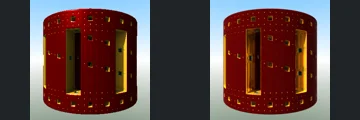
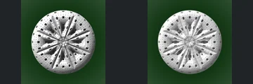
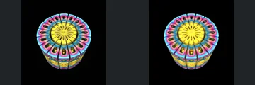
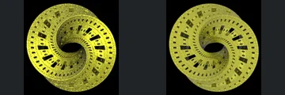
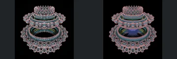
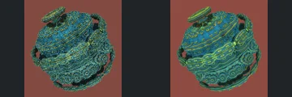

# Reviewed Scenes: Page 31

[Page 1](page-01.md) | [Page 2](page-02.md) | [Page 3](page-03.md) | [Page 4](page-04.md) | [Page 5](page-05.md) | [Page 6](page-06.md) | [Page 7](page-07.md) | [Page 8](page-08.md) | [Page 9](page-09.md) | [Page 10](page-10.md) | [Page 11](page-11.md) | [Page 12](page-12.md) | [Page 13](page-13.md) | [Page 14](page-14.md) | [Page 15](page-15.md) | [Page 16](page-16.md) | [Page 17](page-17.md) | [Page 18](page-18.md) | [Page 19](page-19.md) | [Page 20](page-20.md) | [Page 21](page-21.md) | [Page 22](page-22.md) | [Page 23](page-23.md) | [Page 24](page-24.md) | [Page 25](page-25.md) | [Page 26](page-26.md) | [Page 27](page-27.md) | [Page 28](page-28.md) | [Page 29](page-29.md) | [Page 30](page-30.md) | [Page 31](page-31.md) | [Page 32](page-32.md) | [Page 33](page-33.md) | [Page 34](page-34.md) | [Page 35](page-35.md) | [Page 36](page-36.md) | [Page 37](page-37.md) | [Page 38](page-38.md) | [Page 39](page-39.md) | [Page 40](page-40.md) | [Page 41](page-41.md) | [Page 42](page-42.md) | [Page 43](page-43.md) | [Page 44](page-44.md)

Each thumbnail: native left, FPT authored right. Open a scene for full neutral/beauty comparisons, limitations and capture settings.

## [363: transf_sin_add_asurf](363.md)

accepted-with-limitations | captured-2026-09-12 | 32 SPP

Rough rounded landscape, isolated bright patches and skyline align closely. FPT changes sparkle and small-scale shading but preserves the visible foreground masses and openings.

## [365: transf_sincosHelix_menger3](365.md)

accepted-with-limitations | captured-2026-09-12 | 32 SPP

Red cylindrical body, long vertical recesses and repeated small square holes align. FPT changes internal gold reflection and adds noise without hiding the principal cavities.

## [366: transf_sincosHelix_menger3_001](366.md)

accepted-with-limitations | captured-2026-09-12 | 32 SPP

White circular body, radial deep slots and repeated small perforations align closely. Authored FPT retains the slot shadows and visible circular outline; minor edge shading differs.

## [367: transf_sincos_v2 Mbox_Menger](367.md)

accepted-with-limitations | captured-2026-09-12 | 32 SPP

Segmented rainbow cylinder, radial top pattern and outer oval recesses match closely. FPT changes inner gold highlights while retaining the segment boundaries and openings.

## [368: transf_sincos_v2 Menger](368.md)

accepted-with-limitations | captured-2026-09-12 | 32 SPP

Twisted yellow perforated ring, central hole and repeated square recesses align closely. FPT is more matte and darker while retaining the spiral geometry and larger openings.

## [370: xenodreambuie_v3 aa1](370.md)

accepted-with-limitations | captured-2026-09-12 | 32 SPP

Stacked decorated rings, upper crown and broad lower centre retain their arrangement. FPT replaces native sparkle with matte pink/blue shading and reveals different interior reflections; the large ring boundaries remain readable.

## [371: xenodreambuie_v3](371.md)

accepted-with-limitations | captured-2026-09-12 | 32 SPP

Tilted decorated rounded assembly, upper disc and side loops match closely. FPT smooths blue/gold sparkle while preserving the layered forms and prominent circular motifs.

## [375: Construct by Ectoplaz 2](375.md)

accepted-with-limitations | historical-2026-09-10 | 32 SPP

Main green structure and framing align and remain readable. Native blue atmospheric fill is absent; background contrast and materials differ.

## [378: GeneralizedFoldBox01](378.md)

accepted-with-limitations | historical-2026-09-10 | 32 SPP

Large central surfaces and framing align. FPT is sharper/orange and native blur differs; fine depth and material parity are not certified.

## [379: GeneralizedFoldBox02](379.md)

accepted-with-limitations | refreshed-2026-09-11 | 32 SPP

Refreshed water surface and red sphere are restored; broad cavern framing matches. Reflections, saturation and sphere roughness still differ.
