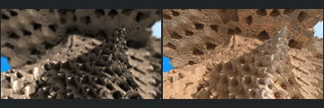
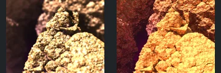
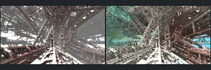
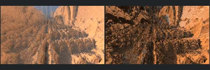
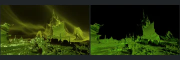

# Reviewed Scenes: Page 32

[Page 1](page-01.md) | [Page 2](page-02.md) | [Page 3](page-03.md) | [Page 4](page-04.md) | [Page 5](page-05.md) | [Page 6](page-06.md) | [Page 7](page-07.md) | [Page 8](page-08.md) | [Page 9](page-09.md) | [Page 10](page-10.md) | [Page 11](page-11.md) | [Page 12](page-12.md) | [Page 13](page-13.md) | [Page 14](page-14.md) | [Page 15](page-15.md) | [Page 16](page-16.md) | [Page 17](page-17.md) | [Page 18](page-18.md) | [Page 19](page-19.md) | [Page 20](page-20.md) | [Page 21](page-21.md) | [Page 22](page-22.md) | [Page 23](page-23.md) | [Page 24](page-24.md) | [Page 25](page-25.md) | [Page 26](page-26.md) | [Page 27](page-27.md) | [Page 28](page-28.md) | [Page 29](page-29.md) | [Page 30](page-30.md) | [Page 31](page-31.md) | [Page 32](page-32.md) | [Page 33](page-33.md) | [Page 34](page-34.md) | [Page 35](page-35.md) | [Page 36](page-36.md) | [Page 37](page-37.md) | [Page 38](page-38.md) | [Page 39](page-39.md) | [Page 40](page-40.md) | [Page 41](page-41.md) | [Page 42](page-42.md) | [Page 43](page-43.md)

Each thumbnail: native left, FPT authored right. Open a scene for full neutral/beauty comparisons, limitations and capture settings.

## [381: Hybrid 1](381.md)

accepted-with-limitations | historical-2026-09-10 | 32 SPP

Central ornament placement and surrounding forms broadly align. Native soft focus becomes sharper and more contrasty in FPT.

## [383: IFS 20](383.md)

accepted-with-limitations | historical-2026-09-10 | 32 SPP

Broad rocky layout and framing align. Different focus, tan materials and sky response are visible; fine-depth fidelity is not claimed.

## [387: IFS 25](387.md)

accepted-with-limitations | refreshed-2026-09-11 | 32 SPP

Oblique stepped block layout, main diagonal opening and camera match. Small surfaces have different highlight strength and colour balance.

## [388: IFS 26](388.md)

accepted-with-limitations | refreshed-2026-09-11 | 32 SPP

Lobed canopy, twisted supports, central sphere and waterline align. FPT sphere reflections are much darker and the water/sky balance is warmer; exact reflective appearance is not certified.

## [391: IFS 29_2](391.md)

accepted-with-limitations | refreshed-2026-09-11 | 32 SPP

Foreground rock outline, top cavity and left background opening align. FPT is sharper and more orange, without native depth-of-field blur; fine surface/optical parity is not claimed.

## [393: IFS 31](393.md)

accepted-with-limitations | refreshed-2026-09-11 | 32 SPP

Dense lattice corridor, central support and converging floor align. FPT has stronger bright speckling at 32 SPP and a coloured rather than grey atmosphere; fine detail/noise parity is not certified.

## [398: aboxmod15](398.md)

accepted-with-limitations | refreshed-2026-09-11 | 32 SPP

Dense central ridges, left foreground rise and right cliff outline align. FPT is sharper with stronger dark creases; native haze and fine-detail noise are not matched.

## [400: aexion01](400.md)

accepted-with-limitations | refreshed-2026-09-11 | 32 SPP

Tall central spire and sweeping stepped flanks align. FPT retains readable green surfaces but omits the native atmospheric sky; atmosphere is explicitly outside this acceptance.

## [406: benesi03](406.md)

accepted-with-limitations | refreshed-2026-09-11 | 32 SPP

Sweeping foreground folds, large upper curl and right-hand branching cavity align closely. Yellow/orange lighting is somewhat stronger in FPT but preserves the same major surface relief.

## [410: bristorbrot01](410.md)

accepted-with-limitations | refreshed-2026-09-11 | 32 SPP

Large receding rings and central spiral align. FPT is sharply defined and strongly gold/magenta rather than hazy grey/gold; depth of field, sky and reflective appearance are not certified.
