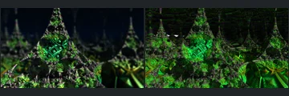
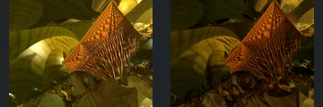
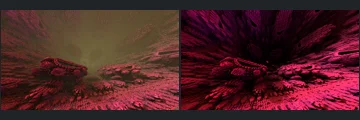
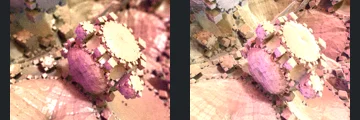

# Reviewed Scenes: Page 34

[Page 1](page-01.md) | [Page 2](page-02.md) | [Page 3](page-03.md) | [Page 4](page-04.md) | [Page 5](page-05.md) | [Page 6](page-06.md) | [Page 7](page-07.md) | [Page 8](page-08.md) | [Page 9](page-09.md) | [Page 10](page-10.md) | [Page 11](page-11.md) | [Page 12](page-12.md) | [Page 13](page-13.md) | [Page 14](page-14.md) | [Page 15](page-15.md) | [Page 16](page-16.md) | [Page 17](page-17.md) | [Page 18](page-18.md) | [Page 19](page-19.md) | [Page 20](page-20.md) | [Page 21](page-21.md) | [Page 22](page-22.md) | [Page 23](page-23.md) | [Page 24](page-24.md) | [Page 25](page-25.md) | [Page 26](page-26.md) | [Page 27](page-27.md) | [Page 28](page-28.md) | [Page 29](page-29.md) | [Page 30](page-30.md) | [Page 31](page-31.md) | [Page 32](page-32.md) | [Page 33](page-33.md) | [Page 34](page-34.md) | [Page 35](page-35.md) | [Page 36](page-36.md) | [Page 37](page-37.md) | [Page 38](page-38.md) | [Page 39](page-39.md) | [Page 40](page-40.md) | [Page 41](page-41.md) | [Page 42](page-42.md) | [Page 43](page-43.md) | [Page 44](page-44.md)

Each thumbnail: native left, FPT authored right. Open a scene for full neutral/beauty comparisons, limitations and capture settings.

## [438: hybrid25](438.md)

accepted-with-limitations | refreshed-2026-09-11 | 32 SPP

The hanging central sphere, surrounding repeated smaller spheres and broad canopy align. FPT replaces the gold atmospheric veil with darker, red-lit surfaces, but the foreground spheres and connections remain readable. Native haze, glow and distant fine detail are not certified.

## [443: hybrid35](443.md)

accepted-with-limitations | opencl-triage-2026-09-27 | 32 SPP

The triangular spires, the green lattice and the dark background correspond. FPT greens are brighter and more saturated, and a few thin white streaks appear near the top-left edge. The overall appearance remains readable.

## [448: hypercomplex 03](448.md)

accepted-with-limitations | refreshed-2026-09-11 | 32 SPP

The sweeping layered curl, central ridge and left/right sky openings align. FPT removes the muted atmospheric veil and uses much stronger cyan/pink bands, while the main layered structure stays readable. Atmosphere and exact palette are not certified.

## [468: mandelbox 22](468.md)

accepted-with-limitations | refreshed-2026-09-11 | 32 SPP

The curved orange lattice, repeated inset ornaments and central receding grid align closely. Fine reflective sparkle and surface brightness differ slightly.

## [469: mandelbox10](469.md)

accepted | opencl-triage-2026-09-27 | 32 SPP

The copper pyramid with its ribbed underside and the olive-gold surrounding forms match the native reference in geometry, palette and lighting direction. The differences are limited to minor tone and noise.

## [472: mandelbox15 - rotations](472.md)

accepted-with-limitations | refreshed-2026-09-11 | 32 SPP

The large curved central arch, surrounding rounded forms and branching interior align broadly. FPT is much brighter orange/red with stronger highlights and less native haze, but the main arches and openings remain readable. Fine highlight detail, light effects and exact exposure are not certified.

## [474: mandelbox18](474.md)

accepted-with-limitations | captured-2026-09-12 | 32 SPP

The tall orange ridged cliff and stepped lower outcrops align. FPT removes the native brown atmospheric veil and uses stronger orange contrast, but the foreground structure remains readable. Distant haze is not certified.

## [475: mandelbox19](475.md)

accepted-with-limitations | experimental-95-2026-09-14 | 32 SPP

The receding tunnel, rounded left overhang, central ledges and dense repeated wall/floor details correspond across the three views. FPT authored rendering retains readable red-lit foreground forms but is sharper and more saturated magenta, with a darker central distance and much less native haze. Background atmosphere and fine-detail appearance differ; the main geometry and foreground illumination remain legible, so this capture is accepted with those limitations.

## [477: mandelbox21](477.md)

accepted-with-limitations | opencl-triage-2026-09-27 | 32 SPP

The cogwheel rings, the pink central body and the surrounding pale surfaces correspond closely. FPT is slightly brighter and less grainy than the native, with a similar pink and cream palette.

## [478: mandelbox23 rotations](478.md)

accepted-with-limitations | captured-2026-09-12 | 32 SPP

The diagonal row of decorated rounded forms, central rectangular inset and curved surrounding walls align. FPT is more uniformly orange/brown and less metallic than native, but the major structures remain legible. Exact highlights and materials are not certified.
