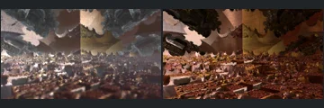

# Reviewed Scenes: Page 35

[Page 1](page-01.md) | [Page 2](page-02.md) | [Page 3](page-03.md) | [Page 4](page-04.md) | [Page 5](page-05.md) | [Page 6](page-06.md) | [Page 7](page-07.md) | [Page 8](page-08.md) | [Page 9](page-09.md) | [Page 10](page-10.md) | [Page 11](page-11.md) | [Page 12](page-12.md) | [Page 13](page-13.md) | [Page 14](page-14.md) | [Page 15](page-15.md) | [Page 16](page-16.md) | [Page 17](page-17.md) | [Page 18](page-18.md) | [Page 19](page-19.md) | [Page 20](page-20.md) | [Page 21](page-21.md) | [Page 22](page-22.md) | [Page 23](page-23.md) | [Page 24](page-24.md) | [Page 25](page-25.md) | [Page 26](page-26.md) | [Page 27](page-27.md) | [Page 28](page-28.md) | [Page 29](page-29.md) | [Page 30](page-30.md) | [Page 31](page-31.md) | [Page 32](page-32.md) | [Page 33](page-33.md) | [Page 34](page-34.md) | [Page 35](page-35.md) | [Page 36](page-36.md) | [Page 37](page-37.md) | [Page 38](page-38.md) | [Page 39](page-39.md) | [Page 40](page-40.md) | [Page 41](page-41.md) | [Page 42](page-42.md) | [Page 43](page-43.md) | [Page 44](page-44.md)

Each thumbnail: native left, FPT authored right. Open a scene for full neutral/beauty comparisons, limitations and capture settings.

## [484: mandelbox29](484.md)

accepted-with-limitations | experimental-95-2026-09-14 | 32 SPP

The tilted carved slabs, repeated arch/opening motifs, central dark recess and large circular upper opening correspond across the three captures. FPT authored rendering retains the native warm-lit slab faces and shadowed recess but is sharper, more orange/red and more contrasty, with harder clipped highlights and a darker background. Native depth-of-field softness is not reproduced. The main carved geometry remains readable; exact blur, lighting and material parity is not claimed.

## [485: mandelbox30](485.md)

accepted-with-limitations | opencl-triage-2026-09-27 | 32 SPP

The green filament network, the pinkish-grey surfaces and the smooth green lower-right region correspond closely. FPT is slightly more saturated; the fine structure and layout match.

## [486: mandelbox32 - spiral](486.md)

accepted-with-limitations | captured-2026-09-12 | 32 SPP

The large curling spiral, central tip, repeated surface ribs and crop align. FPT brightens pink/orange surfaces and changes the background texture response, but the principal spiral remains clearly readable. Exact reflective colour is not certified.

## [487: mandelbox33 - spiral](487.md)

accepted-with-limitations | captured-2026-09-12 | 32 SPP

The two decorated spiral forms, surrounding layered walls and authored crop align closely. FPT changes small reflective highlights and fine surface contrast but preserves the major forms and balanced dark/gold appearance.

## [489: mandelbox36](489.md)

accepted-with-limitations | opencl-triage-2026-09-27 | 32 SPP

The block-city floor, the overhanging slabs and the vertical seam at the image centre (present in the native as well) correspond. FPT is darker and browner than the native, and the native fog haze is weaker in FPT. The principal forms remain readable.

## [493: mandelbox41_2](493.md)

accepted-with-limitations | captured-2026-09-12 | 32 SPP

The crossing chains of rounded forms, upper-left layered cluster and broad enclosing surfaces align. FPT removes much of the native haze and changes reflective colour to pink/gold, but foreground structure remains readable. Atmosphere and distant reflective detail are not certified.

## [494: mandelbox44_2](494.md)

accepted-with-limitations | captured-2026-09-12 | 32 SPP

The repeated stacked bulb-like columns, right foreground column and camera placement align. Both authored views are dark; FPT reduces the native brown veil and strengthens purple contrast, with the main column contours still readable. Atmosphere and deep background illumination are not certified.

## [500: mandelbox50 - hearts](500.md)

accepted-with-limitations | captured-2026-09-12 | 32 SPP

The paired heart-shaped forms, overlapping placement and layered surface bands align. Both views are bright; FPT changes the background from hazy red to green and sharpens the patterned hearts, while the defining contours remain readable. Bloom and fine material response are not certified.

## [507: mandelbox57](507.md)

accepted-with-limitations | captured-2026-09-12 | 32 SPP

The curved foreground blade and repeated ribbed background align. FPT reduces the concentrated white specular highlight and reveals more purple/red background structure than the blurred native view. Main contours remain readable; depth of field and exact specular response are not certified.

## [514: mandelbulb powe 6 - circle](514.md)

accepted-with-limitations | opencl-triage-2026-09-27 | 32 SPP

The butterfly-shaped central form, the dark inner cavity and the scalloped red-gold rim correspond closely in all three views. FPT colour, contrast and rim highlights are very close to native; small differences in fine-detail brightness remain.
