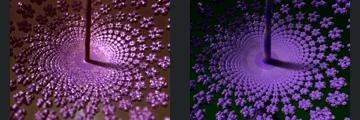
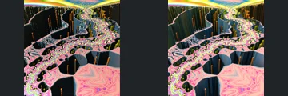
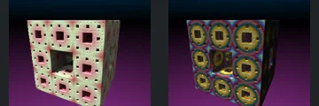

# Reviewed Scenes: Page 35

[Page 1](page-01.md) | [Page 2](page-02.md) | [Page 3](page-03.md) | [Page 4](page-04.md) | [Page 5](page-05.md) | [Page 6](page-06.md) | [Page 7](page-07.md) | [Page 8](page-08.md) | [Page 9](page-09.md) | [Page 10](page-10.md) | [Page 11](page-11.md) | [Page 12](page-12.md) | [Page 13](page-13.md) | [Page 14](page-14.md) | [Page 15](page-15.md) | [Page 16](page-16.md) | [Page 17](page-17.md) | [Page 18](page-18.md) | [Page 19](page-19.md) | [Page 20](page-20.md) | [Page 21](page-21.md) | [Page 22](page-22.md) | [Page 23](page-23.md) | [Page 24](page-24.md) | [Page 25](page-25.md) | [Page 26](page-26.md) | [Page 27](page-27.md) | [Page 28](page-28.md) | [Page 29](page-29.md) | [Page 30](page-30.md) | [Page 31](page-31.md) | [Page 32](page-32.md) | [Page 33](page-33.md) | [Page 34](page-34.md) | [Page 35](page-35.md) | [Page 36](page-36.md) | [Page 37](page-37.md) | [Page 38](page-38.md)

Each thumbnail: native left, FPT authored right. Open a scene for full neutral/beauty comparisons, limitations and capture settings.

## [642: hybrid001](642.md)

accepted-with-limitations | refreshed-2026-09-11 | 32 SPP

The large concentric curved sheets, central opening and smaller right-hand ring align. FPT replaces the native pink atmospheric veil with blue sky and darker gold surfaces; the broad structure is readable, but haze, thin-line brightness and exact reflective colour are not certified.

## [647: hybrid007](647.md)

accepted-with-limitations | refreshed-2026-09-11 | 32 SPP

The converging field of repeated rounded clusters, central upright and its shadow align. FPT uses more matte violet surfaces and a darker background than the native glossy pink/brown appearance; the repeated structure remains readable.

## [648: hybrid008 - collatz](648.md)

accepted-with-limitations | refreshed-2026-09-11 | 32 SPP

The rounded foreground ridges and large curled background forms align. FPT is more orange/green and omits the native blue-grey haze, but the main surface relief remains visible; atmosphere and fine reflective appearance are not certified.

## [652: iq_bulb_001](652.md)

accepted-with-limitations | refreshed-2026-09-11 | 32 SPP

The central branching ridges, side arches and major openings align. FPT is sharper and brown/white instead of the native blurred blue/silver appearance; depth of field, reflections and fine material behaviour remain approximate.

## [655: kaliset001](655.md)

accepted-with-limitations | refreshed-2026-09-11 | 32 SPP

The winding perforated bands, deep vertical walls and large foreground cavities align. FPT retains the vivid pink/yellow surface pattern with sharper edges and altered fine reflective streaks.

## [656: keyframe_anim_mandelbox_boxes](656.md)

accepted-with-limitations | refreshed-2026-09-11 | 32 SPP

The large tilted slab and clustered upper-right cavities align. FPT is brighter yellow with sharper blue/pink markings than the subdued native material; fine reflectance and depth-of-field appearance are not certified.

## [661: mandelbox001](661.md)

accepted-with-limitations | refreshed-2026-09-11 | 32 SPP

The central ornament, four pointed surrounding surfaces and major open gaps align. FPT changes the red/lavender native palette to blue/cyan and differs in reflection contrast, but keeps the principal structure illuminated and readable. Exact reflectance is not certified.

## [664: mandelbox_menger](664.md)

accepted-with-limitations | refreshed-2026-09-11 | 32 SPP

The nested angular walls, large central recess and rectangular surface slots align. FPT changes pale black/white reflections to warm copper/pink and reduces contrast, but the major structure remains readable.

## [665: mandelbox_menger_morph](665.md)

accepted-with-limitations | refreshed-2026-09-11 | 32 SPP

The perforated cube, large front opening and repeated smaller square cavities align in the neutral control. Authored FPT changes the soft pink/green material to strongly reflective gold/blue rings; broad geometry remains readable, while exact reflections and palette are not certified.

## [667: mandelbox_vary_scale_4D_001](667.md)

accepted-with-limitations | refreshed-2026-09-11 | 32 SPP

The sweeping corridor, large left-wall apertures, bright upper opening and right-hand blocklike details align broadly. FPT removes the pale blue atmospheric veil and has stronger gold/green reflections, but the foreground structure remains readable. Distant haze and exact material transport are not certified.
