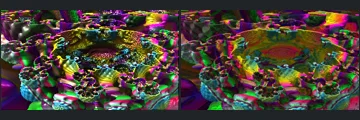
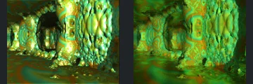

# Reviewed Scenes: Page 35

[Page 1](page-01.md) | [Page 2](page-02.md) | [Page 3](page-03.md) | [Page 4](page-04.md) | [Page 5](page-05.md) | [Page 6](page-06.md) | [Page 7](page-07.md) | [Page 8](page-08.md) | [Page 9](page-09.md) | [Page 10](page-10.md) | [Page 11](page-11.md) | [Page 12](page-12.md) | [Page 13](page-13.md) | [Page 14](page-14.md) | [Page 15](page-15.md) | [Page 16](page-16.md) | [Page 17](page-17.md) | [Page 18](page-18.md) | [Page 19](page-19.md) | [Page 20](page-20.md) | [Page 21](page-21.md) | [Page 22](page-22.md) | [Page 23](page-23.md) | [Page 24](page-24.md) | [Page 25](page-25.md) | [Page 26](page-26.md) | [Page 27](page-27.md) | [Page 28](page-28.md) | [Page 29](page-29.md) | [Page 30](page-30.md) | [Page 31](page-31.md) | [Page 32](page-32.md) | [Page 33](page-33.md) | [Page 34](page-34.md) | [Page 35](page-35.md) | [Page 36](page-36.md) | [Page 37](page-37.md) | [Page 38](page-38.md) | [Page 39](page-39.md) | [Page 40](page-40.md) | [Page 41](page-41.md) | [Page 42](page-42.md) | [Page 43](page-43.md)

Each thumbnail: native left, FPT authored right. Open a scene for full neutral/beauty comparisons, limitations and capture settings.

## [494: mandelbox44_2](494.md)

accepted-with-limitations | captured-2026-09-12 | 32 SPP

The repeated stacked bulb-like columns, right foreground column and camera placement align. Both authored views are dark; FPT reduces the native brown veil and strengthens purple contrast, with the main column contours still readable. Atmosphere and deep background illumination are not certified.

## [500: mandelbox50 - hearts](500.md)

accepted-with-limitations | captured-2026-09-12 | 32 SPP

The paired heart-shaped forms, overlapping placement and layered surface bands align. Both views are bright; FPT changes the background from hazy red to green and sharpens the patterned hearts, while the defining contours remain readable. Bloom and fine material response are not certified.

## [507: mandelbox57](507.md)

accepted-with-limitations | captured-2026-09-12 | 32 SPP

The curved foreground blade and repeated ribbed background align. FPT reduces the concentrated white specular highlight and reveals more purple/red background structure than the blurred native view. Main contours remain readable; depth of field and exact specular response are not certified.

## [528: mandelbulb power 8 - 5 - interior](528.md)

accepted-with-limitations | captured-2026-09-12 | 32 SPP

The central bowl-like opening and repeated curled rims retain their layout and silhouette. Reflective highlight patterns and interior shading differ markedly, but the main nested forms remain readable.

## [531: mandelbulb power 8](531.md)

accepted-with-limitations | captured-2026-09-12 | 32 SPP

Curving layered ridges and nested dark hollows retain close structural and colour agreement across the crop. FPT differs modestly in fine highlights and surface contrast.

## [563: Makin3D-Julia_001](563.md)

accepted-with-limitations | historical-2026-09-10 | 32 SPP

Curved foreground forms remain clear and similarly placed. Pink/yellow native environment becomes dark blue with chrome surfaces; accepted with strong material/environment caveats.

## [564: Abox4D8K](564.md)

accepted-with-limitations | historical-2026-09-10 | 32 SPP

Rounded corridor features and camera framing align. FPT replaces olive highlights with reddish lower-contrast shading.

## [565: Caves-PseudoKleinianMod2](565.md)

accepted-with-limitations | historical-2026-09-10 | 32 SPP

Cave pillars, water/floor extent and framing broadly align. Native reflective highlights and floor response differ.

## [566: Caves2-PseudoKleinianMod2](566.md)

accepted-with-limitations | historical-2026-09-10 | 32 SPP

Cave walls and pillar positions align, with the structure clearly readable. Patterned green FPT materials differ from native highlights.

## [569: coastalbrot_bear](569.md)

accepted-with-limitations | historical-2026-09-10 | 32 SPP

Broad silhouette, placement and main surface forms align. FPT green is darker and more saturated than the native chrome response.
