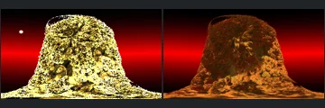
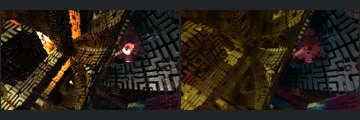
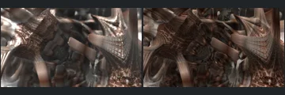
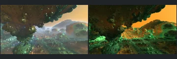

# Reviewed Scenes: Page 38

[Page 1](page-01.md) | [Page 2](page-02.md) | [Page 3](page-03.md) | [Page 4](page-04.md) | [Page 5](page-05.md) | [Page 6](page-06.md) | [Page 7](page-07.md) | [Page 8](page-08.md) | [Page 9](page-09.md) | [Page 10](page-10.md) | [Page 11](page-11.md) | [Page 12](page-12.md) | [Page 13](page-13.md) | [Page 14](page-14.md) | [Page 15](page-15.md) | [Page 16](page-16.md) | [Page 17](page-17.md) | [Page 18](page-18.md) | [Page 19](page-19.md) | [Page 20](page-20.md) | [Page 21](page-21.md) | [Page 22](page-22.md) | [Page 23](page-23.md) | [Page 24](page-24.md) | [Page 25](page-25.md) | [Page 26](page-26.md) | [Page 27](page-27.md) | [Page 28](page-28.md) | [Page 29](page-29.md) | [Page 30](page-30.md) | [Page 31](page-31.md) | [Page 32](page-32.md) | [Page 33](page-33.md) | [Page 34](page-34.md) | [Page 35](page-35.md) | [Page 36](page-36.md) | [Page 37](page-37.md) | [Page 38](page-38.md) | [Page 39](page-39.md) | [Page 40](page-40.md) | [Page 41](page-41.md) | [Page 42](page-42.md) | [Page 43](page-43.md) | [Page 44](page-44.md)

Each thumbnail: native left, FPT authored right. Open a scene for full neutral/beauty comparisons, limitations and capture settings.

## [588: pine-Bulb](588.md)

accepted-with-limitations | refreshed-2026-09-11 | 32 SPP

Layered disks, rounded beads and large silhouette gaps align closely. Green material reflections and highlight intensity differ without obscuring the forms.

## [590: toastn_stonemen_anim](590.md)

accepted-with-limitations | refreshed-2026-09-11 | 32 SPP

Rounded mound, side cavities and base silhouette align. FPT is much less reflective and more orange/brown than the bright gold reference, but major surface relief remains visible; sky-light detail differs.

## [592: hybrid 01 - mandelbox sponge with sphere](592.md)

accepted-with-limitations | historical-2026-09-10 | 32 SPP

Foreground structure and framing align and remain visible. Authored FPT is much brighter and more saturated; accepted with a strong palette/exposure caveat.

## [594: hybrid 02 - rectangle hieroglyphs](594.md)

accepted-with-limitations | historical-2026-09-10 | 32 SPP

Broad lattice and framing align; major surfaces remain readable. Native glow and stronger illumination are absent, so this is not a volumetric-lighting match.

## [595: inverse-reciprocal-iqbulb mechanical-ribs](595.md)

accepted-with-limitations | historical-2026-09-10 | 32 SPP

Broad ribbed shapes and framing align. Native softer focus and brighter highlights differ from the sharper, darker FPT material.

## [596: menger smooth mod 1 - iron man close up](596.md)

accepted-with-limitations | historical-2026-09-10 | 32 SPP

Large folds and warm colours align. FPT contains sharper high-frequency detail and different reflections; fine-detail identity is not claimed.

## [598: aboxmod1_001](598.md)

accepted-with-limitations | historical-2026-09-10 | 32 SPP

Broad landscape and openings align. Native haze becomes sharper, saturated green/orange shading; fog remains out of scope.

## [600: aexion001](600.md)

accepted-with-limitations | historical-2026-09-10 | 32 SPP

Terrain silhouettes and framing align. Native sun disk is absent and FPT is greener/flatter; scene structure remains readable.

## [602: aexion_octopus_001](602.md)

accepted-with-limitations | refreshed-2026-09-11 | 32 SPP

Refreshed water surface is restored and the central object's placement aligns. Wave detail, reflected lighting and shadows differ; 32-SPP water noise remains visible.

## [603: amazing surf mod1 001](603.md)

accepted-with-limitations | refreshed-2026-09-11 | 32 SPP

Refreshed ridge and foreground surface framing align. Native haze and fine highlights differ from the sharper blue FPT terrain; fine structural parity is not certified.
