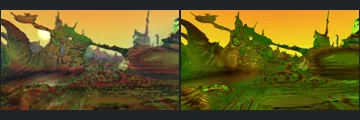
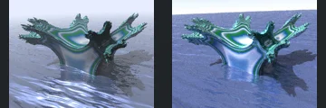
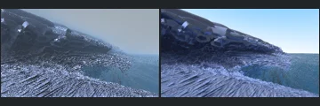
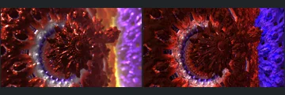
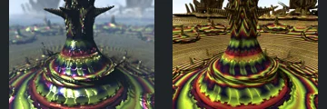

# Reviewed Scenes: Page 38

[Page 1](page-01.md) | [Page 2](page-02.md) | [Page 3](page-03.md) | [Page 4](page-04.md) | [Page 5](page-05.md) | [Page 6](page-06.md) | [Page 7](page-07.md) | [Page 8](page-08.md) | [Page 9](page-09.md) | [Page 10](page-10.md) | [Page 11](page-11.md) | [Page 12](page-12.md) | [Page 13](page-13.md) | [Page 14](page-14.md) | [Page 15](page-15.md) | [Page 16](page-16.md) | [Page 17](page-17.md) | [Page 18](page-18.md) | [Page 19](page-19.md) | [Page 20](page-20.md) | [Page 21](page-21.md) | [Page 22](page-22.md) | [Page 23](page-23.md) | [Page 24](page-24.md) | [Page 25](page-25.md) | [Page 26](page-26.md) | [Page 27](page-27.md) | [Page 28](page-28.md) | [Page 29](page-29.md) | [Page 30](page-30.md) | [Page 31](page-31.md) | [Page 32](page-32.md) | [Page 33](page-33.md) | [Page 34](page-34.md) | [Page 35](page-35.md) | [Page 36](page-36.md) | [Page 37](page-37.md) | [Page 38](page-38.md) | [Page 39](page-39.md) | [Page 40](page-40.md) | [Page 41](page-41.md) | [Page 42](page-42.md) | [Page 43](page-43.md)

Each thumbnail: native left, FPT authored right. Open a scene for full neutral/beauty comparisons, limitations and capture settings.

## [600: aexion001](600.md)

accepted-with-limitations | historical-2026-09-10 | 32 SPP

Terrain silhouettes and framing align. Native sun disk is absent and FPT is greener/flatter; scene structure remains readable.

## [602: aexion_octopus_001](602.md)

accepted-with-limitations | refreshed-2026-09-11 | 32 SPP

Refreshed water surface is restored and the central object's placement aligns. Wave detail, reflected lighting and shadows differ; 32-SPP water noise remains visible.

## [603: amazing surf mod1 001](603.md)

accepted-with-limitations | refreshed-2026-09-11 | 32 SPP

Refreshed ridge and foreground surface framing align. Native haze and fine highlights differ from the sharper blue FPT terrain; fine structural parity is not certified.

## [606: amazing_surf 002](606.md)

accepted-with-limitations | refreshed-2026-09-11 | 32 SPP

Foreground arches, central bowl, curling supports and distant repetition align. FPT is strongly orange and sharp rather than hazy with authored depth of field; atmosphere and optical effects are not certified.

## [611: benesi pwr2 mandelbulbs 001](611.md)

accepted-with-limitations | refreshed-2026-09-11 | 32 SPP

Radial cavity, surrounding ring and right-hand surface boundary align. FPT is sharper with red/blue rather than gold/purple optical shading; depth-of-field and reflective appearance are not certified.

## [612: benesi_mag_transforms_001](612.md)

accepted-with-limitations | refreshed-2026-09-11 | 32 SPP

Radial petal composition and center align in the geometry control. FPT reflective appearance is sharper and strongly magenta rather than brown/pink; exact material transport is not certified.

## [614: benesi_t1_pine_tree_001](614.md)

accepted-with-limitations | captured-2026-09-13 | 32 SPP

Blue radial interior, bright central opening and surrounding repeated lobes align. FPT has sharper edges, a smaller central bloom and less atmospheric softness, but the principal structure and light pattern are retained. Acceptance does not certify bloom or fine centre detail hidden by the native highlight.

## [617: box_fold_bulb_pow2_001](617.md)

accepted-with-limitations | refreshed-2026-09-11 | 32 SPP

Central tiered spire, surrounding repeated spires and camera align. FPT is sharper with strongly patterned gold ground; native clouds and depth-of-field blur are not reproduced.

## [626: diFS square grid](626.md)

accepted-with-limitations | refreshed-2026-09-11 | 32 SPP

Curved perforated surface, surrounding grid and foreground reflective forms align. FPT has warmer highlights and stronger brightness on the right; the principal geometry remains readable.

## [627: difs_tree](627.md)

accepted-with-limitations | refreshed-2026-09-11 | 32 SPP

Tree canopy silhouette, trunk, rolling grass terrain and cast shadow align. FPT canopy shadows are darker and the trunk is browner, but the main forms remain visible.
