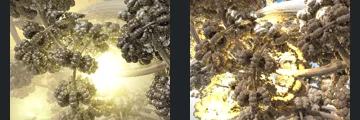
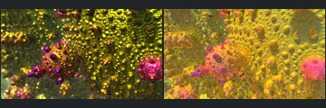

# Reviewed Scenes: Page 41

[Page 1](page-01.md) | [Page 2](page-02.md) | [Page 3](page-03.md) | [Page 4](page-04.md) | [Page 5](page-05.md) | [Page 6](page-06.md) | [Page 7](page-07.md) | [Page 8](page-08.md) | [Page 9](page-09.md) | [Page 10](page-10.md) | [Page 11](page-11.md) | [Page 12](page-12.md) | [Page 13](page-13.md) | [Page 14](page-14.md) | [Page 15](page-15.md) | [Page 16](page-16.md) | [Page 17](page-17.md) | [Page 18](page-18.md) | [Page 19](page-19.md) | [Page 20](page-20.md) | [Page 21](page-21.md) | [Page 22](page-22.md) | [Page 23](page-23.md) | [Page 24](page-24.md) | [Page 25](page-25.md) | [Page 26](page-26.md) | [Page 27](page-27.md) | [Page 28](page-28.md) | [Page 29](page-29.md) | [Page 30](page-30.md) | [Page 31](page-31.md) | [Page 32](page-32.md) | [Page 33](page-33.md) | [Page 34](page-34.md) | [Page 35](page-35.md) | [Page 36](page-36.md) | [Page 37](page-37.md) | [Page 38](page-38.md) | [Page 39](page-39.md) | [Page 40](page-40.md) | [Page 41](page-41.md) | [Page 42](page-42.md) | [Page 43](page-43.md)

Each thumbnail: native left, FPT authored right. Open a scene for full neutral/beauty comparisons, limitations and capture settings.

## [673: mandelbulb4_001](673.md)

accepted-with-limitations | refreshed-2026-09-11 | 32 SPP

The large interlocking curved loops, left-pointing centre and upper arc align. FPT is sharper with stronger red/white reflections than the softer native view. Both have very bright surfaces; broad geometry is retained but highlight-level detail and reflective transport are not certified.

## [675: mandelbulb_eye](675.md)

accepted-with-limitations | refreshed-2026-09-11 | 32 SPP

The faceted blue circular form, off-centre nested rings and silhouette align. FPT is darker and lacks the native bright upper highlight, but the principal facets remain readable. Exact shading is not certified.

## [682: menger cross mod1 001](682.md)

accepted-with-limitations | refreshed-2026-09-11 | 32 SPP

The nested spiral, repeated angular blocks and large foreground curl align closely. FPT has smoother pink/gold shading and fewer sparkling highlights; broad depth layering and framing remain readable.

## [688: menger smooth mod1](688.md)

accepted-with-limitations | refreshed-2026-09-11 | 32 SPP

The sweeping curved corridor, right-hand rounded slots and concentrated central illuminated feature align. Both are intentionally dark with green/gold highlights; FPT changes reflection and fine highlight distribution while keeping the structure readable.

## [690: menger-mod1_001](690.md)

accepted-with-limitations | refreshed-2026-09-11 | 32 SPP

The large crossing beams, repeated angular recesses and red panels broadly align. FPT removes the pale native veil/blur and has stronger dark red contrast, but the foreground structural layout stays readable. Distant optical effects and fine reflective detail are not certified.

## [691: monte carlo DOF 001](691.md)

accepted-with-limitations | refreshed-2026-09-11 | 32 SPP

The nested perforated frames, central bright opening and purple/pink surfaces align broadly. FPT is sharper and brighter while native strongly blurs the foreground, so depth-of-field and fine near-surface detail are not certified. The large-scale framing and structure remain readable.

## [702: msltoe_donut_001](702.md)

accepted-with-limitations | captured-2026-09-12 | 32 SPP

The clustered rounded forms and large crossing tubular arcs align broadly. Native haze and its large central light bloom are replaced by sharper, differently distributed FPT highlights. Foreground structure remains readable; bloom, atmosphere and fine reflective transport are not certified.

## [703: msltoe_julia_bulb_eiffie_001](703.md)

accepted-with-limitations | captured-2026-09-12 | 32 SPP

The prominent pink rounded cluster, lower-left diagonal branch and surrounding field of small forms align broadly. Native shallow-focus sparkling gold becomes sharper yellow/orange FPT surfaces. Broad placement survives; depth of field and tiny reflective details are not certified.

## [704: msltoe_julia_bulb_mod2_001](704.md)

accepted-with-limitations | captured-2026-09-12 | 32 SPP

The central decorated dome, upper bulbs and layered lower foreground align broadly. FPT is substantially brighter yellow/orange and less blurred than native, but the main contours and decorated central surface remain readable. Depth of field, bright peripheral highlights and exact material response are not certified.

## [708: msltoesym2_mod_002](708.md)

accepted-with-limitations | captured-2026-09-12 | 32 SPP

The large central circular opening, crossing diagonal foreground bar and clustered surrounding forms align broadly. FPT changes the red/orange reflections and sharpens details blurred in native, but preserves readable major structure. Fine reflection and depth-of-field parity are not certified.
