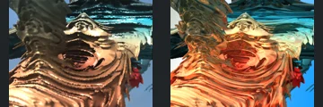
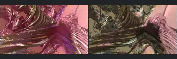
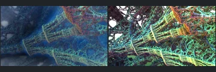
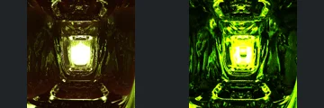
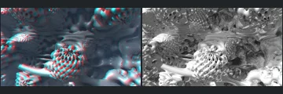
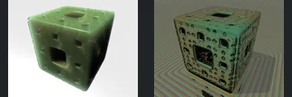
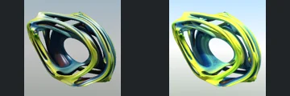

# Reviewed Scenes: Page 43

[Page 1](page-01.md) | [Page 2](page-02.md) | [Page 3](page-03.md) | [Page 4](page-04.md) | [Page 5](page-05.md) | [Page 6](page-06.md) | [Page 7](page-07.md) | [Page 8](page-08.md) | [Page 9](page-09.md) | [Page 10](page-10.md) | [Page 11](page-11.md) | [Page 12](page-12.md) | [Page 13](page-13.md) | [Page 14](page-14.md) | [Page 15](page-15.md) | [Page 16](page-16.md) | [Page 17](page-17.md) | [Page 18](page-18.md) | [Page 19](page-19.md) | [Page 20](page-20.md) | [Page 21](page-21.md) | [Page 22](page-22.md) | [Page 23](page-23.md) | [Page 24](page-24.md) | [Page 25](page-25.md) | [Page 26](page-26.md) | [Page 27](page-27.md) | [Page 28](page-28.md) | [Page 29](page-29.md) | [Page 30](page-30.md) | [Page 31](page-31.md) | [Page 32](page-32.md) | [Page 33](page-33.md) | [Page 34](page-34.md) | [Page 35](page-35.md) | [Page 36](page-36.md) | [Page 37](page-37.md) | [Page 38](page-38.md) | [Page 39](page-39.md) | [Page 40](page-40.md) | [Page 41](page-41.md) | [Page 42](page-42.md) | [Page 43](page-43.md)

Each thumbnail: native left, FPT authored right. Open a scene for full neutral/beauty comparisons, limitations and capture settings.

## [727: quick-dudley_001](727.md)

accepted-with-limitations | captured-2026-09-12 | 32 SPP

The sweeping layered foreground, central recessed form and upper-left vertical structure align. FPT changes reflective colour toward brighter orange and cyan while retaining the principal contours, openings and authored crop. Exact reflective transport is not certified.

## [728: quick-dudley_mod_001](728.md)

accepted-with-limitations | captured-2026-09-12 | 32 SPP

The layered crossing foreground band, curved upper forms and right-hand folded structure align. FPT changes the native pink metallic reflections to darker gold/brown and sharper background detail, but retains the main geometry and framing. Fine optical transport is not certified.

## [733: sierpinski 3D 002](733.md)

accepted-with-limitations | captured-2026-09-12 | 32 SPP

The diagonal layered lattice and large curved upper-right band retain their framing and visible openings. Native blue atmospheric softness becomes a sharp multicoloured high-contrast lattice; broad structure remains visible, but haze, highlights and subpixel strands are not matched.

## [734: smooth_mandelbox_001](734.md)

accepted-with-limitations | captured-2026-09-12 | 32 SPP

The repeated rectangular tunnel, curved side walls and central bright region remain recognisable and aligned. FPT is greener and reveals different reflective inner bands; optical reflection and highlight intensity are not matched, but the main form remains readable.

## [737: stereoscopic 003](737.md)

accepted-with-limitations | captured-2026-09-12 | 32 SPP

The central bead-covered protrusion, left rods and rounded background forms remain recognisable. Native red/cyan stereo is not reproduced and FPT reflections differ; acceptance is for broad monocular structure and readable illumination, not stereo or exact optical parity.

## [740: subsurface scattering 002](740.md)

accepted-with-limitations | captured-2026-09-12 | 32 SPP

The perforated cube silhouette and major square openings correspond. Native smooth subsurface green shading becomes rougher, sharper material with a patterned environment; accepted for the readable cube and openings, not subsurface transport or environment parity.

## [746: voxel_export_with_Bristorbrot4D](746.md)

accepted-with-limitations | captured-2026-09-12 | 32 SPP

The intertwined rounded frame, central hole and multiple outer openings align closely. FPT is brighter and more yellow with a lighter environment, but preserves the full open structure.
