# Mandelbulber compatibility architecture

The `mandel` branch investigates how Metal-FPT can reproduce Mandelbulber2's
procedural fractals without maintaining hundreds of handwritten Metal shaders.
The geometry remains procedural: the imported formula is evaluated for every
distance query, and Metal-FPT's existing marcher, normals, materials, and path
tracer consume that distance. No voxel representation is involved.

## Current result

Coverage has deliberately separate levels:

| Level | Result | Meaning |
|---|---:|---|
| Catalog | 459 formula records | The CSV and C++ constructor union recovers five formulas omitted from `formulaData.csv` |
| Fixed formula frontend | 458/458 parsed | Every fixed upstream OpenCL kernel parses, including IDs 281-285 |
| Formula smoke Metal | 458/458 compile | Every fixed kernel lowers and passes Apple's Metal compiler in isolation |
| Formula geometry coverage | 747/747 example dependencies | All active formula slots have a generated runtime kernel and distance path |
| Scene specialization | 746/747 generated | Every fractal-bearing example specializes; `light types.fract` disables all fractal slots and is primitive-only |
| Full-scene Metal oracle | 746/746 pass | Every generated scene-specialized shader passes Apple's offline Metal compiler |
| Independent CPU reference | 11 formula families | IFS, bulb/quaternion families, Mandelbox families, Jos/Pseudo-Kleinian, and Msltoe Donut have separate `f64` orbit implementations |
| Hybrid scheduler | 9 formula slots | Counts, ranges, repetition, weights, per-slot C policy, bailout checks, and analytic/delta finalization lower to generated Metal |
| Boolean formulas | 9 independent slots | Per-formula transforms and orbit evaluators combine with union, intersection, or subtraction |
| Embedded custom source | Qt base64/zlib import | Scene-owned `formula_code` is decoded, validated, translated, and specialized without a hard-coded shader |

The formula-geometry count is deliberately not called full visual parity.
Metal-FPT now evaluates the procedural geometry for every fractal-bearing
example, but it still uses its own path tracer and does not yet reproduce every
Mandelbulber scene feature. Volumetric nebula integration, all fog modes,
Mandelbulber primitives, panoramic/stereo projection, material graphs, DOF,
textures, and animation tracks are reported separately from formula support.
The `nebula 001.fract` custom iteration therefore imports successfully as a
procedural field, while matching Mandelbulber's volume accumulation remains a
scene-feature milestone.

The scheduler imports default bailout, constant-C policy, Julia state, initial
W, constant multiplier, iteration controls, weighting, and distance
finalization. Delta-DE uses one base orbit plus three forward finite-difference
orbits, and fixes the offset probes to the base orbit's completed iteration
count as Mandelbulber does. Metal-FPT uses a float-stable relative perturbation
for its four-orbit delta path; this still needs broader image qualification
before delta scenes are called visually equivalent.

The audited upstream revision is
`230456cee40968cbaa7f301bba91daa4865a29db`. Its example collection contains
747 scenes, including 353 hybrids and 315 distinct referenced formula IDs.

### Capability tiers

| Tier | Current status |
|---|---|
| Procedural formula geometry | Implemented for every active fixed or embedded-custom formula in the example corpus |
| Analytic distance | Implemented for logarithmic, linear, IFS, Jos/Pseudo-Kleinian, custom/dIFS, and hybrid-selected finalizers |
| Numerical distance | Implemented with float-stable four-orbit delta-DE for standalone and hybrid programs |
| Formula composition | Hybrid scheduling and independent boolean union/intersection/subtraction implemented |
| Camera and marching | Perspective position/orientation/FOV plus resolution-aware thresholds, DE factor and clamps, the 0.95 hit band, five-step hit refinement, and normal smoothness imported |
| Surface colour | `mat1` fixed colour or procedural surface gradient imported; Mandelbulber's colour orbit selects the gradient coordinate only at an accepted hit |
| Shading | Metal-FPT roughness/specular defaults, lights, normals, and path tracing intentionally replace Mandelbulber's illumination model |
| Atmosphere/volume | Mandelbulber basic/volumetric/iteration fog, clouds, and nebula accumulation not yet reproduced |
| Scene primitives | Not yet imported; `light types.fract` is primitive-only and therefore has no procedural fractal specialization |
| Animation | Static parameter state imports; frame/keyframe tables are ignored by the still-image renderer |

The coverage report records enabled feature flags so formula progress cannot be
mistaken for those remaining scene-feature tiers. In the audited examples, 197
request volumetric fog, 115 DOF, 82 basic fog, 28 iteration fog, 19 clouds, six
stereo, and four nebula mode; several also enable water, planes, boxes, spheres,
cylinders, tori, rectangles, or a cone.

## Architecture

```text
Mandelbulber source tree
  formulaData.csv + enums + C++ definitions + initparameters.cpp
              |                         |
              v                         v
       formula registry          parameter schema
              |                         |
              +-----------+-------------+
                          |
Mandelbulber .fract ------+----> scene dependency manifest
                          |
                          v
                 OpenCL formula frontend
                 lexer + balanced parser
                 member-read discovery
                 construct classification
                          |
                          v
                    Metal lowering
             types + address spaces + constants
             vector literals + math + matrices
             shared helper-function lowering
                          |
              +-----------+-----------+
              |                       |
              v                       v
      standalone smoke kernel    FPT field specialization
                                      |
                                      v
                           ordinary procedural marcher
                                      |
                                      v
                           Metal-FPT path tracer
```

The generator reads Mandelbulber from an external checkout at build/run time.
Generated Metal artifacts carry a GPL notice and belong in an ignored cache or
report directory. The Apache-licensed repository does not vendor 453 generated
formula files.

### Shared lowering rules

The frontend handles the constructs used by the complete fixed-formula corpus:

- OpenCL pointer syntax and Metal `thread`/`constant` address spaces;
- `REAL`, vector types, compound vector literals, and native math functions;
- Mandelbulber's complete nested parameter schema;
- row-structured `matrix33` operations and Metal `float3x3` runtime parameters;
- referenced mathematical constants only;
- shared rotation, smooth-condition, and wrapping helpers;
- loops, switches, ternaries, matrix operations, and auxiliary orbit mutation;
- integer-backed Boolean arrays without C++ narrowing errors.

This is source translation, not 453 handwritten ports. Formula-specific code
comes from the selected external Mandelbulber source file.

## Catalog and compiler commands

Generate deterministic metadata from a Mandelbulber checkout:

```bash
cargo run --release -- mandel-catalog /path/to/mandelbulber2 \
  --out reports/mandel/catalog
```

The output contains `formula-registry.json`, `parameter-schema.json`,
`scene-dependencies.json`, and `catalog-summary.json`.

Audit the frontend only:

```bash
cargo run --release -- mandel-audit /path/to/mandelbulber2 \
  --report reports/mandel/compiler-audit.json
```

Audit every available kernel with Apple's Metal compiler:

```bash
cargo run --release -- mandel-audit /path/to/mandelbulber2 \
  --report reports/mandel/compiler-audit-metal.json \
  --metal-check --metal-out reports/mandel/compiler-audit-metal
```

Generate the authoritative dependency/eligibility report:

```bash
cargo run --release -- mandel-coverage /path/to/mandelbulber2 \
  --catalog-out reports/mandel/catalog \
  --report reports/mandel/coverage.json
```

Specialize all 747 example scenes with their actual parameters and schedules;
add `--metal-check` to invoke Apple's compiler for every full shader:

```bash
cargo run --release -- mandel-scene-audit /path/to/mandelbulber2 \
  --report reports/mandel/scene-audit.json --metal-check
```

The scene audit is stricter than the formula smoke audit. It detects invalid
enum serialization, derived-parameter mistakes, aggregate layout errors,
scene-specific hybrid schedule failures, and embedded custom-source failures.

Compile one formula by numeric ID or enum symbol:

```bash
cargo run --release -- mandel-compile /path/to/mandelbulber2 8 \
  --out reports/mandel/mandelbox.metal \
  --report reports/mandel/mandelbox.json
```

Representative successful families include Hypercomplex (ID 4), Mandelbox
(ID 8), Pseudo-Kleinian (ID 103), DIFS Sphere (ID 604), generalized fold box,
smooth formulas, 4D formulas, and formulas using helper rotations.

## End-to-end rendering

Runtime specialization requires the same source checkout so the selected
formula is generated and compiled into the full Metal-FPT shader:

```bash
cargo run --release -- render scenes/mandelbulber/ifs-20.fract \
  --out reports/mandel/ifs20-fpt --renderer sdf \
  --mandelbulber-root /path/to/mandelbulber2 \
  --width 960 --height 540 --samples 64
```

Omitting `--mandelbulber-root` retains the precompiled IFS compatibility path.
All other formula families require generated source. Runtime Metal compilation
is cached by source hash. After the generalized scheduler changed its source
hash, a cold Power2 build measured 3.43 s. Warm Hypercomplex and Quaternion
builds measured 17.9 and 17.6 ms.

Inspect the exact scene-specialized shader and generated parameter constants
with:

```bash
cargo run --release -- mandel-scene-compile /path/to/scene.fract \
  --mandelbulber-root /path/to/mandelbulber2 \
  --out /tmp/scene.metal
```

At 320x180 and 8 spp, generated IFS rendered in 400.43 ms. At 320x240 and
8 spp, generated Power2 rendered in 294.55 ms after its cold build. These are
engineering smoke measurements, not comparisons with equivalent Mandelbulber
lighting or sampling.

### Corpus benchmarking and pipeline cache

`mandel-benchmark` measures scene generation, cold and immediate-warm library
builds, complete execution wall time, GPU render time, generated source size,
image health, and failures. Offset/limit/stride selection permits staged corpus
runs and identical cohorts for comparing compiler strategies:

```bash
cargo run --release -- mandel-benchmark /path/to/mandelbulber2 \
  --report reports/mandel-benchmark/cohort.json \
  --out reports/mandel-benchmark/images \
  --kernel-set offline-render --offset 0 --limit 50 --stride 15 \
  --width 120 --height 68 --samples 1 --warm-runs 1
```

The initial eight-scene pilot found that full runtime-source compilation took
5.34 seconds at the median while the GPU render took 28.4 ms. Retaining only
the selected accumulation kernel and `present_kernel` reduced source by about
60 KB and the first measured cold build to 3.74 seconds, with six images
pixel-identical and one differing by one pixel out of 8,160.

Offline source compilation then reduced the source-compile portion to roughly
0.34 seconds, but the broader 50-scene cohort showed that first pipeline-state
creation—not source translation—was the remaining dominant cost: 3.94 seconds
median complete execution setup versus 38.0 ms median GPU rendering. The
cohort covered 25 hybrids and one delta estimator; 49/50 rendered non-blank
images. `TransfSphereCoordInv_bulbs.fract` produced one GPU-hang error during
the long compiler-heavy cohort. Four staged first-hit diagnostics then passed
at both 32x18 and 120x68, an isolated path render passed at 48.6 ms, and ten
cached process-isolated repeats passed at 42.2-62.3 ms. The hang is therefore
recorded as a transient driver event rather than a deterministic scene failure;
full-corpus jobs should remain process-isolated so one driver event cannot
invalidate later measurements.

Normal Mandelbulber renders now use a content-addressed, kernel-pruned
`.metallib` and one Metal binary pipeline archive per generated scene topology.
The first render populates both artifacts. A separate process rendering the
same IFS scene subsequently reduced reported build time from 6,115.6 ms to
1.08 ms, while GPU time remained 33.9 ms. If Apple's optimized pipeline
compiler terminates with `XPC_ERROR_CONNECTION_INTERRUPTED`, the topology is
marked and rebuilt once with `-O0`; later processes reuse that fallback and its
archive. The known `ifs_xy.fract` failure follows this path and subsequently
loads in 1.09 ms, at the cost of a slower approximately 198-218 ms GPU kernel.

Set `FPT_MANDEL_RENDER_CACHE_DIR` to relocate or isolate this cache. Cache keys
include the retained generated source, accumulation kernel, target
architecture, and Metal compiler identity.

For full-corpus measurements, use the process-isolated runner. It launches one
renderer process at a time, checkpoints every scene, reports command-buffer
GPU time separately from compilation/setup wall time, and derives reciprocal
FPS as `1000 / GPU milliseconds`:

```bash
python3 scripts/mandel_corpus_benchmark.py /path/to/mandelbulber2 \
  --audit reports/mandel-benchmark/full-corpus-scene-audit.json \
  --out reports/mandel-benchmark/full-corpus-120x68-1spp \
  --width 120 --height 68 --samples 1
```

On Apple M1 Max, the complete 747-scene example catalog contained 746 scenes
eligible for generated rendering. At 120x68 and 1 spp, 731 produced validated
images after a cached retry pass. Their GPU-time distribution was 35.38 ms
median, 186.43 ms p90, 370.13 ms p95, and 3,407.60 ms maximum. The reciprocal
median is 28.27 FPS. Twelve remaining scenes repeatedly triggered macOS's
`Impacting Interactivity` GPU watchdog and three produced blank or
single-colour images; they are excluded from the numeric ranking and retained
as explicit failures in `report.json`.

Apple's temporary `com.apple.gpuarchiver` directory grew to 4 GB during the
first pass and exhausted the system data volume. The runner can be given the
exact, verified cache path with `--gpu-archiver-cache`; it purges that
regenerable cache only between isolated child processes. The persistent
content-addressed Metal-FPT cache remains intact. Complete results are written
to `gpu-ranking.md`, `gpu-ranking.tsv`, and `report.json`, sorted by GPU
milliseconds from highest to lowest.

### Surface colour and the Metal-FPT material bridge

The importer now preserves Mandelbulber's `mat1` surface-colour controls:

- fixed `surface_color` values;
- the complete serialized `surface_color_gradient`, including its cyclic
  closure;
- `use_colors_from_palette`, `surface_color_gradient_enable`,
  `coloring_speed`, and `palette_offset`;
- normal, hybrid, and colour-by-numbers orbit-colouring algorithms and their
  radius, XYZ, iteration, auxiliary-colour, and curve controls.

Geometry marching remains distance-only. Once a hit is accepted, the generated
shader performs a separate colour orbit, computes Mandelbulber's scalar colour
index, wraps it into the source gradient, and writes the resulting RGB into a
normal Metal-FPT material. This avoids paying for palette/orbit state at every
sphere-tracing step. Hybrid scenes use the generated hybrid schedule for the
colour orbit. Boolean scenes first select the winning formula with the same CSG
comparison as the distance program, then evaluate colour for that formula.

This is a deliberately narrow bridge rather than a second shading system.
Metal-FPT still owns roughness, specular response, transmission, emission,
lighting, bounces, and tone mapping. Per-formula material IDs in Boolean scenes,
Mandelbulber reflection/transparency/luminosity gradients, textures, and
material displacement remain future imports.

Three diagnostics separate the stages without evaluating path lighting:

```bash
cargo run --release -- diagnostic /path/to/scene.fract \
  --out reports/mandel/material --mode material \
  --mandelbulber-root /path/to/mandelbulber2 --width 960 --height 540

cargo run --release -- diagnostic /path/to/scene.fract \
  --out reports/mandel/colour-index --mode mandel-color-index \
  --mandelbulber-root /path/to/mandelbulber2 --width 960 --height 540

cargo run --release -- diagnostic /path/to/scene.fract \
  --out reports/mandel/palette-position --mode mandel-palette-position \
  --mandelbulber-root /path/to/mandelbulber2 --width 960 --height 540
```

`mandel-color-index` visualizes the unwrapped procedural coordinate;
`mandel-palette-position` visualizes the wrapped normalized lookup position;
and `material` shows the RGB passed to Metal-FPT's BSDF. Together they make it
possible to distinguish an orbit-colouring mismatch from a gradient lookup or
lighting mismatch.

The following smoke sheet compares six controlled upstream renders (left) with
the new Metal-FPT colour bridge (right) at 120x68 and 8 spp. Unsupported fog,
DOF, volumes, and primitives were disabled for the upstream geometry renders.
The source surface-colour family is now visible in Metal-FPT, while differences
from lighting, post-processing, and unresolved colour-orbit parity remain.

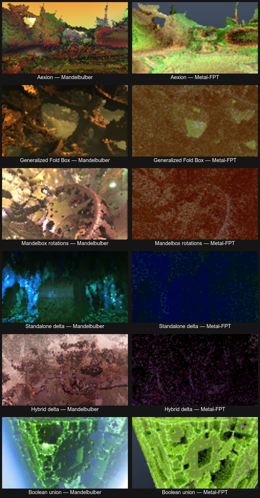

### Scene-level geometry qualification

The renderer now imports Mandelbulber's ray-detail contract instead of freezing
the hit tolerance at the camera-to-target distance. Each march step selects the
scene's constant `DE_thresh` or recomputes the distance-dependent threshold,
applies `detail_size_min/max`, multiplies by `DE_factor`, and applies the
advanced absolute/relative step clamps when enabled. A hit uses Mandelbulber's
`distance < 0.95 * threshold` test and five half-step refinements. Surface
normals use the same local threshold multiplied by the scene's `smoothness`.

CLI dimensions are applied before deriving that threshold. This is essential
for reduced contact-sheet renders: using a scene's native 1080-row threshold
for a 68-row comparison traced a different, roughly 16x finer surface.
Zero-aperture renders also bypass focus-plane arithmetic; several deep-zoom
scenes place camera and target so close that constructing a float focus point
otherwise collapses the primary ray. Boolean formula instances now follow
Mandelbulber's `point *= formulaScale; distance /= formulaScale` convention.

This closed a serious deep-zoom failure and made the corrected paths much
faster. At 120x68 and 8 spp, excluding cold Metal compilation:

| Scene | Legacy fixed threshold | Corrected exact marcher | Speedup |
|---|---:|---:|---:|
| Generalized Fold Box 01 | 15,905 ms | 746 ms | 21.3x |
| Generalized Fold Box 03_2 (delta) | 8,565 ms | 448 ms | 19.1x |
| FoldIntPow2 2 (hybrid delta) | 3,482 ms | 765 ms | 4.6x |
| Mandelbox 15 rotations | 975 ms | 53 ms | 18.4x |

`diagnostic --mode hit-mask` provides a deterministic geometry-only view that
does not conflate formula coverage with Metal-FPT's deliberately different
lighting and materials:

```bash
cargo run --release -- diagnostic /path/to/scene.fract \
  --out reports/mandel/hit-mask --mode hit-mask \
  --mandelbulber-root /path/to/mandelbulber2 \
  --width 960 --height 540
```

The comparison below predates the surface-colour bridge and disables unsupported
fog, DOF, volume, primitives, and procedural displacement in the upstream
geometry renders. The columns are upstream OpenCL and Metal-FPT path tracing at
120x68 and 8 spp. Lighting, material response, and atmosphere are intentionally
different.

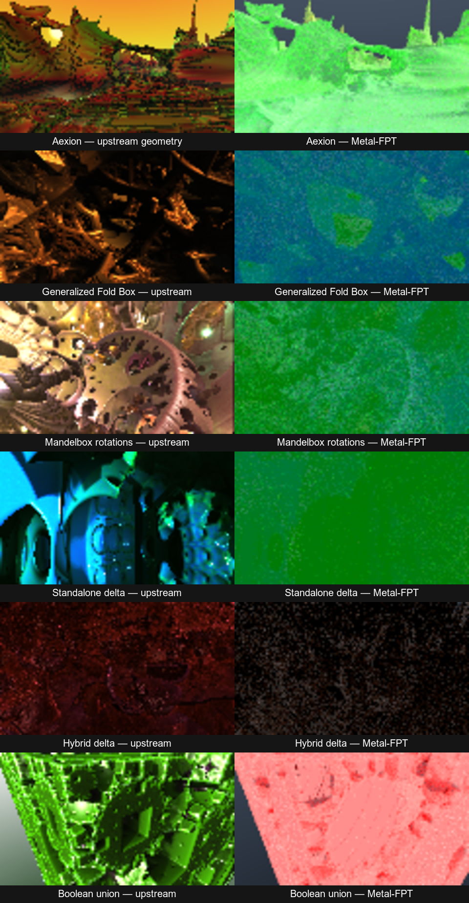

The world-normal AOV comparison removes those presentation differences. It
uses identical cameras and resolutions and shows first-hit geometry directly.
The channel colours differ because Metal-FPT maps Mandelbulber's Y/Z axes into
its own coordinate convention; matching spatial structures are the parity
signal.

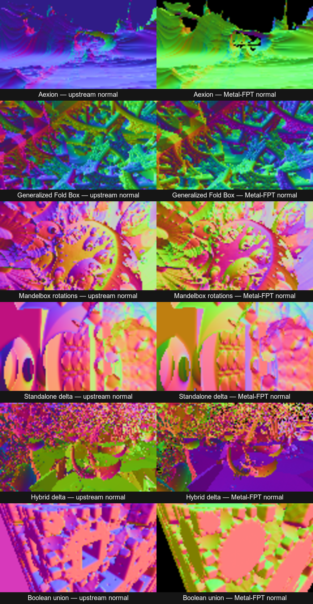

For a more direct normal-parity check, `diagnostic --mode diffuse-normal`
performs one primary march and one geometric-normal evaluation, then applies a
fixed camera-facing Lambert term:

```text
0.12 + 0.88 * max(dot(normal, -cameraForward), 0)
```

It does not evaluate materials, lights, shadows, fog, post-processing, or any
path-traced bounce. Misses remain black. The upstream comparison is derived
from Mandelbulber's 16-bit camera-space normal AOV: its blue channel stores
`(1 - cameraForwardNormal) / 2`; the z-buffer AOV masks missed rays. This makes
both columns use the same scalar function of the first-hit normal despite the
renderers' different world-axis conventions.

```bash
cargo run --release -- diagnostic /path/to/scene.fract \
  --out reports/mandel/diffuse-normal --mode diffuse-normal \
  --mandelbulber-root /path/to/mandelbulber2 \
  --width 480 --height 272
```

The matching upstream inputs can be exported with the Apple-Silicon wrapper:

```bash
python3 /path/to/mandelbulber2/tools/mandelbulber_m1.py render scene.fract \
  --out upstream.png --resolution 480x272 --opencl-mode full \
  --override optional_image_channels_enabled=1 \
  --override normal_enabled=1 --override normal_quality=1 \
  --override zbuffer_enabled=1 --override zbuffer_quality=1 \
  --override DOF_enabled=0 --override DOF_monte_carlo=0

magick upstream_normal.png upstream_zbuffer.png \
  -fx 'v < 0.99999 ? 0.12+0.88*max(2*u.b-1,0) : 0' \
  upstream_diffuse_normal.png
```

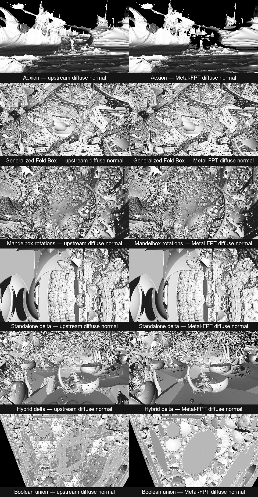

The six 480x272 fixtures preserve the same broad composition and make the
remaining incompatibilities much easier to localise. Normalised MAE is
lower-is-better, SSIM is higher-is-better, and silhouette IoU measures first-hit
coverage independently of normal direction:

| Scene | MAE | SSIM | Silhouette IoU |
|---|---:|---:|---:|
| Aexion | 0.061 | 0.741 | 0.926 |
| Generalized Fold Box | 0.121 | 0.529 | 1.000 |
| Mandelbox rotations | 0.106 | 0.574 | 1.000 |
| Standalone delta | 0.053 | 0.770 | 1.000 |
| Hybrid delta | 0.142 | 0.375 | 0.982 |
| Boolean union | 0.105 | 0.366 | 0.999 |

Generalized Fold Box, Mandelbox rotations, and standalone delta have effectively
identical first-hit coverage, although their high-frequency normal values still
differ. The diagnostic also proves that parity is not yet complete: Aexion has
a visible missed central region, while hybrid delta and Boolean union retain
local normal/shape disagreements. These are geometry or normal-estimation
issues rather than lighting differences and are the next parity targets.
Metal-FPT's measured diagnostic kernel time was 20.9-123.5 ms per fixture;
shader compilation and process startup are excluded.

### Generated runtime eligibility

Runtime eligibility is proof-based rather than name-based. The frontend records
every `fractal->member` read, recursively reconstructs the nested Metal
parameter types, and accepts a kernel only when every read has a direct or
derived scene binding. Direct bindings come from `sFractal`'s
`container->Get<T>()` assignments and `initparameters.cpp` defaults. Derived
bindings reproduce `RecalculateFractalParams`, including trigonometric caches,
rotation matrices, squared radii, ratios, inverses, Mandelbox fold-matrix grids,
and generalized-fold normal tables.

The table below records the earlier hand-packed milestone and its parity
fixtures; it is retained as regression history, not as the current allowlist:

| ID | Formula | Finalizer | C policy |
|---:|---|---|---|
| 2 | Classic Mandelbulb | logarithmic | enabled by default |
| 3 | Mandelbulb Power 2 | logarithmic | enabled by default |
| 4 | Hypercomplex | logarithmic | enabled by default |
| 5 | Quaternion | logarithmic | enabled by default |
| 8 | Mandelbox | linear | enabled by default |
| 9 | Mandelbox Fast | linear | enabled by default |
| 10 | Kaleidoscopic IFS | IFS | already handled by formula |
| 11 | Xenodreambuie | logarithmic | enabled by default |
| 13 | Mandelbulb2 | logarithmic | enabled by default |
| 14 | Mandelbulb3 | logarithmic | enabled by default |
| 15 | Mandelbulb4 | logarithmic | enabled by default |
| 21 | Bristorbrot | logarithmic | enabled by default |
| 48 | Quick Dudley | logarithmic | enabled by default |
| 49 | Lkmitch | logarithmic | enabled by default |
| 50 | Makin3D-2 | logarithmic | enabled by default |
| 83 | IQ Bulb | logarithmic | enabled by default |
| 88 | Collatz | IFS | disabled by default |
| 102 | Bristorbrot 4D | logarithmic | enabled by default |
| 103 | Pseudo-Kleinian | Pseudo-Kleinian | disabled by default |
| 122 | Jos Kleinian | Jos Kleinian | disabled by default |
| 129 | Coastalbrot | logarithmic | enabled by default |
| 130 | Modulus Menger Sponge | IFS | disabled by default |
| 131 | Modulus Mandelbulb | logarithmic | enabled by default |
| 607 | dIFS Menger | custom distance | disabled by default |
| 610 | dIFS Msltoe Donut | custom distance | disabled by default |
| 1113 | Linear Cube DE transform | custom distance | disabled by default |
| 1600 | dIFS Box transform | custom distance | disabled by default |
| 1602 | dIFS Ellipsoid transform | custom distance | disabled by default |
| 1603 | dIFS Hextgrid2 transform | custom distance | disabled by default |
| 1604 | dIFS Sphere transform | custom distance | disabled by default |
| 1613 | dIFS Grid transform | custom distance | disabled by default |
| 1639 | dIFS Chessboard transform | custom distance | disabled by default |
| 1646 | dIFS Torus V4 transform | custom distance | disabled by default |

These 33 remain accepted by the complete FPT runtime shader. The earlier 24 were
rendered at least at 96x54, 1 spp. The six earlier additions built in 3.41-4.62 s and rendered in
10.0-75.3 ms. These small runs are compiler and geometry smoke tests, not
performance comparisons. Contact sheets are at
`reports/mandel/runtime-families/contact-sheet.png` and
`reports/mandel/runtime-families/bulb-family-contact-sheet.png`, with the new
groups at `reports/mandel/runtime-families/shared-parameter-contact-sheet.png`.
Mandelbox Fast was additionally rendered at 320x180, 8 spp at
`reports/mandel/runtime-families/mandelbox-fast/mandelbox-fast.png`.
Full Mandelbox was rendered at 960x540, 32 spp in 7.92 s on an Apple M1 Max;
its cold generated-library build took 2.93 s. The fixture deliberately enables
all six per-axis rotations rather than showing only the simpler scalar fold.

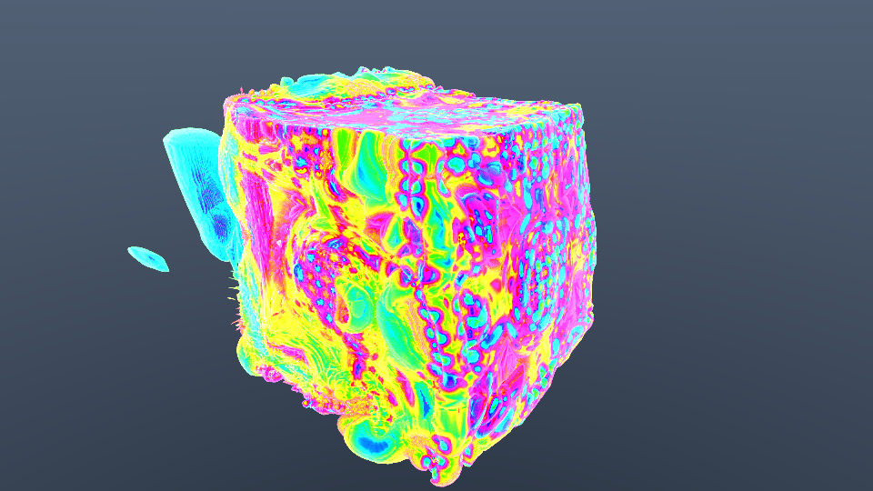

The bulb binding is shared infrastructure, not four manual formula ports. It
packs `power`, `alpha_angle_offset`, `beta_angle_offset`, and
`gamma_angle_offset` once, including Mandelbulber's degree-to-radian conversion,
then reuses the generated OpenCL-to-Metal body for every formula whose complete
parameter-read set fits that block.

The analytic-DE binding packs all nine fields with upstream defaults and scene
overrides. The first transform subset intentionally exposes only four proven
fields: `additionConstant0000`, `scale3`, `pwr8`, and `pwr8a`. A formula is
eligible only when its entire read set fits a supported block. Scene import now
also implements Mandelbulber's global-versus-formula-default bailout switch.

Mandelbox Fast added the first derived matrix/radius binding. The initializer
squares the fixed and minimum radii, derives their ratio, and reproduces
Mandelbulber's `SetRotation2` order (`Rz * Ry * Rx`) from degree-valued scene
angles. Full Mandelbox reuses that machinery and adds the box-fold limit and
value, pre/post sphere-fold offset, colour factors, main rotation, and six
negative/positive per-axis fold matrices. Each inverse is generated as the
transpose of its orthonormal rotation, matching Mandelbulber's
`RecalculateFractalParams`. The nested arrays are passed as one immutable Metal
constant, so the generated formula body remains upstream-derived code rather
than a handwritten shader port.

### Declarative compact parameter bindings

Compact custom-distance formulas no longer require a handwritten Metal struct
and initializer per formula. One binding descriptor records the exact upstream
member path, its `.fract` scene key and default, and whether the value is a
scalar, boolean, integer, vector, or derived rotation matrix. The compiler
intersects this table with the parsed formula's actual member reads, rejects an
incomplete mapping, groups fields by upstream parameter root, and emits a
minimal nested Metal constant block. Component reads such as
`foldColor.difs0000.x` are covered by the whole-vector binding. Degree-valued
rotations use Mandelbulber's `SetRotation2` order.

This migrated dIFS Msltoe Donut away from its bespoke binding and added six
7-to-13-field transforms without six more handwritten schemas. Representative
fixtures exercise both ends of the generated type system:

| Fixture | Binding coverage | Mean error | p99 | Maximum | Failures / iteration mismatches |
|---|---|---:|---:|---:|---:|
| `linear-cube-generated.fract` | scalar and boolean | `5.59e-8` | `1.94e-7` | `3.71e-7` | 0 / 0 |
| `hybrid-difs-grid-hypercomplex.fract` | scalar, boolean, integer, vector, matrix | `1.72e-8` | `8.13e-8` | `2.24e-7` | 0 / 0 |
| `difs-box-generated.fract` | vector, scalar, boolean, integer | `4.39e-8` | `1.40e-7` | `2.12e-7` | 0 / 0 |
| `difs-ellipsoid-generated.fract` | vector, boolean, integer | `7.80e-8` | `2.77e-7` | `4.89e-7` | 0 / 0 |
| `difs-sphere-generated.fract` | analytic scalar, 4D flag, color range | `1.25e-7` | `3.71e-7` | `6.51e-7` | 0 / 0 |
| `difs-chessboard-generated.fract` | vectors, inverted flags, mutation range | `8.10e-8` | `2.44e-7` | `2.44e-7` | 0 / 0 |

All comparisons evaluate 65,536 deterministic points in independent CPU
`f64` code against generated Metal `f32`. The Grid fixture also found a real
reference-path defect: custom DIFS results were incorrectly replaced by orbit
radius whenever a preceding formula left the analytic derivative at zero.
Custom distance now bypasses that analytic-only guard, with a regression test.

At 480x270 and 16 spp on an Apple M1 Max, Linear Cube rendered in 470 ms after
a 3.25 s cold build; the rotated Grid/Hypercomplex hybrid rendered in 813 ms
after a 3.21 s cold build. These are integration timings, not matched
Mandelbulber performance comparisons.

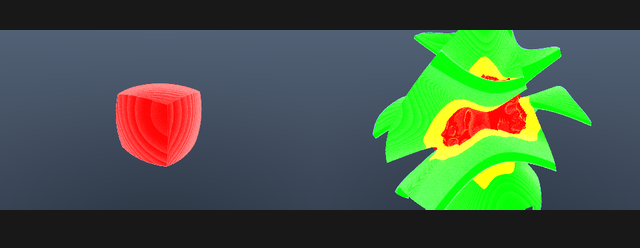

The remaining four compact transforms render at the same 480x270, 16 spp
integration setting. Box, Ellipsoid, Sphere, and Chessboard measured 361, 275,
208, and 266 ms respectively; cold builds were 3.11-4.23 s. The unmodified
upstream `T_DIFS Chessboard.fract` independently passes the same 65,536-point
gate with mean error `8.10e-8`, p99 and maximum `2.44e-7`, and no failures or
iteration mismatches.

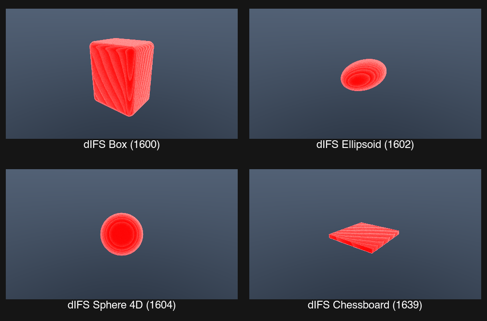

### Companion formula and upstream hybrid qualification

The Box, Ellipsoid, and Sphere examples were initially blocked by companion
formula IDs 1603, 607, and 1646. All three companion programs now use the same
generated parameter infrastructure and have independent CPU implementations.
The resulting unmodified upstream scenes pass as complete hybrids:

| Upstream scene | Formula composition | Mean error | p99 | Maximum | Failures / iteration mismatches |
|---|---|---:|---:|---:|---:|
| `hex grid 002.fract` | Jos Kleinian + Hextgrid2 + Box | `6.29e-8` | `3.24e-7` | `3.31e-6` | 0 / 0 |
| `T_DIFS Torus4_sphere.fract` | Torus V4 + Sphere | `1.30e-7` | `5.48e-7` | `9.09e-7` | 0 / 0 |
| `DIFS Menger Ellipsoid.fract` | dIFS Menger + Ellipsoid | `3.85e-8` | `1.43e-7` | `1.26e-6` | 0 / 0 |

Hextgrid2 adds pre-scaling, signed absolute folds, derived hex-grid spacing,
rotation, and round/square tube sections. Torus V4 adds scheduled scale/fold
and rotation windows plus a derived angle binding: one degree-valued scene
parameter emits the radian angle and its sine/cosine exactly as Mandelbulber's
recalculation step does.

dIFS Menger is deliberately not described as compact. Its 71 parameter reads
cover scheduled folds, reverse offsets, variable scale state, rotation, an
iterated Menger distance loop, pseudo-Kleinian derivative state, and color
selection. It is the first large common-parameter program handled by the
declarative schema. The generated Metal block still contains only fields the
parsed formula proves it reads.

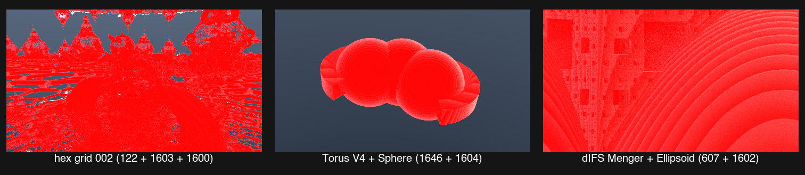

At 480x270 and 16 spp, Torus/Sphere rendered in 420 ms and Menger/Ellipsoid in
4.87 s. The Hexgrid scene costs about 940 ms per sample; monolithic 4 and 8 spp
dispatches therefore hit macOS's interactive GPU watchdog. Using the existing
chunked accumulation mode with one sample per command buffer rendered all 16
samples successfully in 14.13 s, without changing geometry or random seeds:

```bash
cargo run --release -- render /path/to/hex\ grid\ 002.fract \
  --out reports/mandel/companion-upstream/hex-grid-002 --renderer sdf \
  --mandelbulber-root /path/to/mandelbulber2 \
  --width 480 --height 270 --samples 16 \
  --sdf-accumulation chunked --sdf-chunk-samples 1
```

Reproduce the validation and Grid render with:

```bash
cargo run --release -- mandel-parity \
  scenes/mandelbulber/linear-cube-generated.fract --samples 65536 \
  --mandelbulber-root /path/to/mandelbulber2 \
  --report reports/mandel/linear-cube-generated-parity.json

cargo run --release -- render \
  scenes/mandelbulber/hybrid-difs-grid-hypercomplex.fract \
  --out reports/mandel/generated-bindings/difs-grid --renderer sdf \
  --mandelbulber-root /path/to/mandelbulber2 \
  --width 480 --height 270 --samples 16
```

That earlier v11 audit was superseded by the complete compiler frontend and is
retained only as regression history; the current authoritative totals are in
the coverage table at the top of this document.

### Generated nine-slot hybrid scheduler

Hybrid scenes use the same generated formula frontend rather than a second
handwritten evaluator. The importer reads all nine `formula_N` and `fractal_N`
sections plus formula counts, weights, inclusive start/stop ranges, enable
flags, `repeat_from`, C-addition overrides, and bailout controls. It then
reproduces Mandelbulber's `cNineFractals::CreateSequence` on the host for the
scene's bounded iteration count.

Each generated formula is placed in its own Metal namespace. This allows nine
different parameter schemas, helper functions, and identically named upstream
types to coexist in one shader. The iteration loop indexes the immutable
sequence, dispatches the selected formula, applies its C policy, performs
Mandelbulber's length-preserving `SmoothCVector` weight blend, blends derivative
and colour state, and checks the selected slot's bailout policy.

The nine-slot compiler fixture combines Power2, Hypercomplex, Quaternion,
Bristorbrot, Lkmitch, Makin3D-2, IQ Bulb, Bristorbrot 4D, and Coastalbrot. At
96x54 and 1 spp it compiled all nine namespaces in 5.59 s and rendered in
52.9 ms on an Apple M1 Max. The two-slot independently validated fixture was
rendered at 960x540 and 32 spp in 2.49 s after a 3.15 s cold build.

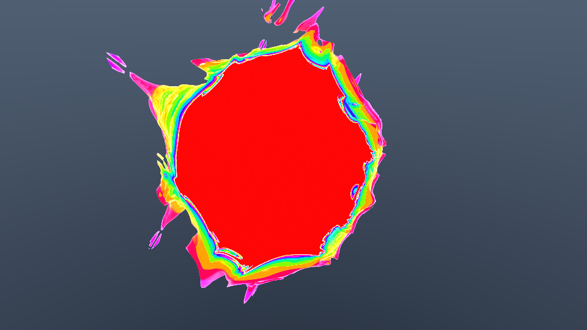

Hybrid execution supports both analytic and four-orbit delta distance paths.
The DE selector reproduces Mandelbulber's
six-way precedence: linear, logarithmic, Pseudo-Kleinian, Jos Kleinian, custom
distance, and max-axis; custom/dIFS wins whenever present, otherwise the
highest scheduled count wins with enum order breaking ties. Pseudo-Kleinian,
Jos Kleinian, and custom-distance now have complete, independently validated
runtime families. Max-axis has its final expression but no qualifying packed
formula yet. Boolean object composition is implemented separately from the
hybrid scheduler with independent transformed formula slots.

Kaleidoscopic IFS is now a first-class hybrid slot. Each namespace receives
its own absolute-axis flags, nine enable flags, normalized directions, nine
rotation matrices, plane distances and intensities, main rotation, offset,
edge fold, scale, and Menger mode. The mixed Hypercomplex + IFS fixture enables
all of the nontrivial groups and passes 65,536 independent `f64` CPU versus
Metal samples with mean absolute distance error `1.87e-7`, p99 `6.94e-7`,
maximum `1.29e-6`, zero distance failures, and zero iteration mismatches.

### Kleinian and custom-distance results

Three unmodified upstream scenes now exercise the non-linear/log finalizers
over 65,536 independently evaluated points:

| Upstream scene | Formula | Mean error | p99 | Maximum | Failures / iteration mismatches |
|---|---|---:|---:|---:|---:|
| `jos_kleinian 001.fract` | Jos Kleinian (122) | `4.84e-8` | `3.20e-7` | `2.63e-6` | 0 / 0 |
| `pseudo kleinian 001.fract` | Pseudo-Kleinian (103) | `5.39e-8` | `1.63e-7` | `3.33e-7` | 0 / 0 |
| `msltoe_donut_001.fract` | dIFS Msltoe Donut (610) | `3.52e-8` | `1.09e-7` | `2.43e-7` | 0 / 0 |

The Jos-dominant hybrid fixture also passes 65,536 samples with mean error
`1.92e-7`, p99 `1.58e-6`, maximum `1.50e-5`, and no failures. A second hybrid
combines one custom-distance donut iteration with two logarithmic Hypercomplex
iterations; custom distance correctly takes precedence and passes with mean
error `4.80e-8`, p99 `1.24e-7`, maximum `2.04e-7`, and no failures.

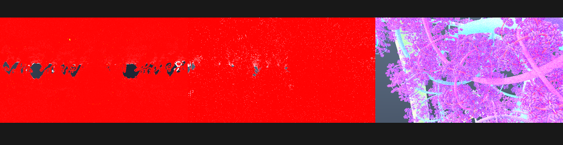

The Pseudo-Kleinian documentation render exposed an operational limit rather
than a geometry error. A 480x270, 16 spp interactive dispatch tripped macOS's
GPU watchdog. Deterministic reductions passed at 320x180: 1 spp in 364 ms,
4 spp in 1.24 s, and 8 spp in 4.44 s. Offline work for similarly expensive
fields should therefore be chunked instead of placed in one long interactive
command buffer.

### Imported upstream hybrid validation

The generated scheduler now runs an unmodified Mandelbulber example rather
than only repository-authored fixtures. Krzysztof Marczak's CC-BY 4.0
`hybrid15.fract` combines Quaternion, full Mandelbox, and Kaleidoscopic IFS.
Its 65,536-sample validation produced mean absolute distance error `2.02e-8`,
p99 `9.61e-8`, maximum `1.91e-6`, and zero distance failures. Sixty samples
(`0.092%`) crossed a per-slot bailout on different iterations in `f32` Metal
and the independent `f64` reference, so the report is geometry-qualified but
deliberately not orbit-qualified. A 480x270, 16 spp smoke render took 6.31 s
after a 3.94 s cold generated-library build on an Apple M1 Max.

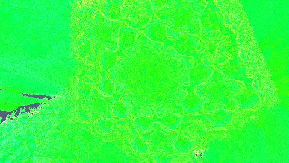

The upstream `hybrid23.fract` stress scene is retained as a negative result.
Its non-escaping samples drive the derivative down to roughly `1e-22`, making
the linear distance approximately `1e21`; ordinary `f32`/`f64` rounding then
exceeds the strict relative gate in 13 of 65,536 samples. This is numerical
conditioning evidence, not a hidden compatibility success, and it is not used
as the qualified demonstration.

### Coordinates and camera

Mandelbulber uses Z as image-up and Y as camera-forward; Metal-FPT uses Y as
up and Z as forward. Positions and vectors map as `(x, y, z) -> (x, z, y)`.
Camera position, target, top vector, and roll are retained.

The FOV conversion is:

```text
FOV_fpt = 2 * atan(2 * tan(FOV_mandelbulber / 2))
```

The imported scenes are uniformly scaled by 1024 for Metal-FPT's numerical
range. The generated field divides query positions by 1024 and multiplies the
distance by 1024, preserving shape and camera composition. The power-of-two
scale also preserves the source-coordinate fp32 mantissa through the
multiply/divide round trip, which is important for deep Kleinian zooms.

## Validation

Run deterministic CPU-`f64` versus generated Metal-`f32` field validation:

```bash
cargo run --release -- mandel-parity scenes/mandelbulber/ifs-20.fract \
  --samples 65536 --mandelbulber-root /path/to/mandelbulber2 \
  --report reports/mandel/ifs20-parity.json
```

Generated Kaleidoscopic IFS at 65,536 samples:

| Metric | Result |
|---|---:|
| Mean absolute distance error | `2.784e-7` |
| P99 absolute distance error | `1.008e-6` |
| Maximum absolute distance error | `1.830e-6` |
| Distance failures | `0` |
| Iteration mismatches | `541` (`0.826%`) |
| Geometry qualification | pass |

The iteration mismatch is separate from geometry qualification. Points near a
bailout boundary may cross on adjacent iterations in `f32` and `f64` while
retaining close distance values.

Power2 is visually and structurally usable, but its 500-iteration interior
regime is not qualified by the same `f64` metric. Its derivative can shrink
below `f32` range. Mandelbulber's source semantics then take the `DE <= 0`
radius fallback, while `f64` can produce enormous finite distances from a tiny
positive derivative. The report records 611 precision-limited samples, 56
non-finite comparisons, and 14 additional tolerance failures out of 65,536.
This limitation is reported rather than hidden by widening the tolerance.

Hypercomplex and Quaternion independently validate the generalized scheduler,
not only the generated formula body. The tests exercise default C-addition for
Hypercomplex and Julia-C addition for Quaternion.

| Formula | Mean absolute error | P99 | Maximum | Failures | Iteration mismatches | Result |
|---|---:|---:|---:|---:|---:|---|
| Hypercomplex | `3.167e-6` | `5.544e-7` | `1.184e-1` | 1/65,536 | 0 | qualified |
| Quaternion | `7.874e-8` | `3.307e-7` | `2.150e-6` | 0/65,536 | 0 | qualified |

The Hypercomplex mean and maximum are dominated by one narrow numerical
outlier; its 99th percentile remains below `6e-7`, and both geometry and orbit
qualification pass under the existing fixed acceptance policy.

Classic Mandelbulb also has an independent CPU implementation. A power-8 scene
with non-zero alpha and beta offsets measured mean `1.007e-7` and P99
`3.997e-7`, proving that the generated parameter initializer is active. It is
not marked qualified: the chaotic boundary produced 44 iteration divergences,
three tolerance failures, and two non-finite GPU samples out of 65,536. A
power-2 binding fixture removed the iteration divergences and measured P99
`6.430e-7`, but still includes the two exact-origin singular samples implied by
the upstream formula's disabled `r == 0` guard. Both reports remain explicit
rather than weakening the global qualification policy.

Quick Dudley independently validates the generated `analyticDE` block with
non-default values (`scale1 = 1.25`, `offset1 = 0.5`). Across 65,536 samples it
measured mean `8.178e-8`, P99 `4.386e-7`, and maximum `1.124e-6`, with zero
distance failures, iteration mismatches, or non-finite samples. Geometry and
orbit qualification both pass.

Mandelbox Fast validates the derived radii and non-default 10°/20°/30° main
rotation. Across 65,536 samples it measured mean `2.686e-8`, P99 `1.605e-7`,
and maximum `5.244e-5`, with one distance failure and no non-finite samples.
Geometry qualification passes. There are 438 adjacent-iteration divergences in
the discontinuous fold orbit, so orbit qualification remains separately false.

Full Mandelbox has two independent 65,536-sample checks. The scalar-fold
fixture measured mean `3.945e-8`, P99 `1.922e-7`, and maximum `3.091e-6`, with
zero distance failures or non-finite samples. The fully rotated fixture sets
non-default fold limits, radii, offset, colour values, main rotation, and all
six fold rotations; it measured mean `7.573e-8`, P99 `6.156e-7`, and maximum
`6.102e-4`, with one distance failure and no non-finite samples. Both pass the
geometry qualification policy. Their 191 and 143 adjacent-iteration
divergences keep orbit qualification false, as expected for chaotic fold
boundaries evaluated in `f32` versus `f64`.

The hybrid scheduler has a separate CPU `f64` implementation rather than
validating the Metal shader against itself. A Hypercomplex/Quaternion fixture
uses a `Hypercomplex, Hypercomplex, Quaternion` repeating sequence and a 0.75
weight on Hypercomplex, exercising
formula dispatch, length-preserving vector interpolation, derivative blending,
and per-formula C addition. Across 65,536 samples it measured mean
`1.678e-7`, P99 `9.333e-7`, and maximum `2.387e-6`, with zero distance
failures, iteration mismatches, or non-finite samples. Geometry and orbit
qualification both pass.

The CPU evaluator is an independent precision port of the shared orbit
semantics, not proof against Mandelbulber's executable. Matched source renders
and diagnostic AOVs remain required for each newly integrated family.

## What remains for broad scene compatibility

Formula geometry now covers the fractal-bearing example corpus. The remaining
work is scene-feature and qualification work rather than another shader-porting
campaign:

1. Extend the parity sample ABI to compare the new generated colour and
   auxiliary state against an independent CPU/upstream oracle, not only
   distance, radius, derivative, and iteration count.
2. Automate matched depth/world-normal/colour AOV qualification across representative
   scenes and then the full example corpus.
3. Import per-formula material selection and additional material channels,
   Mandelbulber primitives, and material displacement, followed by fog, clouds,
   DOF, stereo/panoramic projection, and volume/nebula integration.
4. Tune Metal-FPT presentation without obscuring first-hit and colour-coordinate
   parity.
5. Benchmark generated formulas against Mandelbulber OpenCL using matched field
   and marcher workloads.

The durable abstraction is therefore a small formula compiler plus a generated
orbit program, not a permanent library of manual shaders.

## Licensing boundary

Metal-FPT is Apache-2.0 and Mandelbulber2 is GPLv3-or-later. Generated formula
artifacts are derived from the external Mandelbulber source and explicitly
retain that boundary. The generated runtime must not be represented as ready
for an Apache-only distribution without a licensing decision. This is an
engineering constraint, not legal advice.

The bundled `ifs-20.fract` example is attributed to Krzysztof Marczak under
CC BY 4.0, matching the source example collection's declaration.
