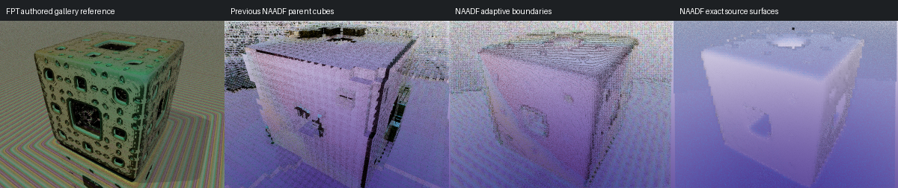

# Adaptive transmission — 14 September 2026

**All 427 accepted FPT scenes now execute through adaptive NAADF cubes.** The
fresh full screen renders every scene at 96px, one sample and four bounces,
with no black or uniform captures. All **424 captures from the previous adaptive
baseline are pixel-identical**. Scenes 380 and 627 remain successful after their
export recovery, and translucent scene 740 now executes through adaptive cells.

This completes catalogue execution coverage. It does **not** establish clean
visual parity with FPT. No NAADF visual acceptance decisions were promoted.
See [source-bound results](naadf-transmission-results-20260914.json).

## Transport and material changes

The adaptive path treats occupied children as a piecewise-constant material
volume. A ray outside the volume uses the existing accelerated NAADF traversal
to find its first child. A ray inside a medium traverses children until it finds
air or a different authored medium. It returns that exact boundary and travel
distance, including transitions across 4×/8×/16×/32× parents. It no longer jumps
over a whole parent or skips the exit interface.

The two sides of each adaptive boundary supply their own IOR. Reflection stays
on the incident side; transmission starts on the other side. Adjacent different
media are handled directly. Child colour changes inside one authored medium do
not create optical boundaries. The adaptive volume supplies the current medium
directly; the existing native MATL shell path retains its four-entry stack.

The host resolves each immutable `VQLMAT1` sample to two GPU slots: a child RGB
shading slot and a canonical authored-medium slot. The former source-ID word is
converted in the runtime copy only. On-disk files and the converter remain
unchanged. Absorption now respects full-width material indices rather than
aliasing values above 255, and uses the traced distance through the current
medium. The existing material-level attenuation model is retained.

Boundary stepping handles exact faces, edges and corners. A normal float is
used when crossing coordinate zero because Metal flushes subnormal nextafter
steps to zero. The production Metal 2.4 path steps IEEE-754 bits where needed.
Ray offsets are capped below the smallest supported child width.

Translucent adaptive bundles declare `fpt_adaptive_transmission`. The loader
requires that declaration, and the viewer refuses a consumer without the
capability even in diagnostic mode. Native transmission requires complete
subcell material data; legacy parent-only translucent local masks still fail
explicitly. RGB sample alpha remains 255; optical transmission comes from the
authored material, not from that colour byte.

## Verification

* **1,088 GPU boundary cases** cover gaps, adjacent media, colour changes,
  positive/negative/parallel rays, corner ties and mixed resolutions. Random
  filled-volume rays are compared against an analytic AABB, both near zero and
  at parent coordinates `(512,128,64)`. Medium IDs 300 and 700 remain distinct.
* **Nine optical cases** verify absorption distance, wide versus legacy palette
  indexing, zero absorption, negative-distance clamping, Snell refraction,
  normal-incidence Fresnel and total internal reflection.
* **33 Python tests** pass, including translucent capability rejection and
  opaque bundle, payload, scheduler and launcher regressions. C++ loaders pass
  four material levels and 56 malformed-payload cases.
* Mixed 4/32, 8/32 and 16/32 native leaves remain pixel-identical to equivalent
  uniform leaves. The child-colour/optics probe passes, and the 283-material
  full-parent regression remains pixel-identical.
* The existing nested-glass MATL scene is pixel-identical before/after at
  320×180, 64 samples and eight bounces.
* The full 427-scene native run takes 94.50 seconds with two workers on this
  machine. This is an execution observation, not a controlled speed benchmark.
* The installed default app matches the tested build by executable and all four
  Metal-library hashes. Its installation smoke image matches the catalogue
  capture exactly. Generated shader-wrapper and whitespace checks pass.

Full catalogue receipts, hashes and comparisons are in
`reports/fpt-transmission-catalog-20260914/`; focused probes are in
`reports/fpt-transmission-20260914/`, both in the consumer checkout.

## Visual review and next work

Scene 740 was also captured at 300×225, 32 samples and eight bounces. Its bake
passes independent occupancy verification. The comparison below is qualitative:
the gallery reference is not a pixel golden with identical capture settings.



The new adaptive image remains pale/purple and loses many of the reference's
small holes and surface details. Exact-source NAADF surfaces also differ
substantially. These observations rule out calling the scene visually accepted.

The occupied children are conservative voxels of captured source surfaces.
They do not reconstruct the complete source-fractal interior, so a transparent
source can become a set of thin voxel shells. Interior/rear-surface coverage,
source transport semantics, lighting and colour correspondence remain separate
work. More samples alone will not close these gaps.

The next pipeline gate should compare matched neutral geometry and authored
appearance renders, then address complete medium geometry and shared material /
lighting semantics through the FPT library. The 427-scene execution screen now
provides a regression baseline for that work.

## Reproduce

From the consumer checkout:

```sh
./run_metal_voxel.sh --build-only
clang++ -std=c++17 -fobjc-arc tools/test_local_transmission.mm \
  -framework Foundation -framework Metal -o build/test_local_transmission
build/test_local_transmission .
python3 tools/test_adaptive_transmission.py \
  --manifest /path/to/translucent/bundle/manifest.json \
  --converter build/voxel-converter/target/release/voxel_refinement_probe \
  --app build/MetalVoxel.app/Contents/MacOS/MetalVoxel \
  --output reports/new-transmission-test --maximum-axis 300 --samples 32
```

`tools/check_adaptive_render_regression.py` rerenders a source-bound adaptive
baseline and accepts extra `ID=manifest.json` bundles for newly supported scenes.
It checks image health and strict pixel equality for baseline cases and records
executable, shader, bundle, receipt and image identities.
