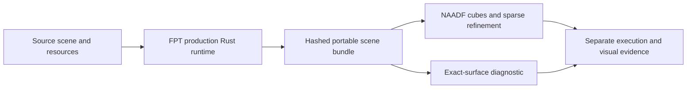

# FPT library → NAADF integration

Latest result: [adaptive transmission](naadf-adaptive-transmission.md) completes **427/427**
native adaptive execution, with 424 prior captures pixel-identical. Visual
acceptance remains outstanding. The results below describe the earlier stage.

Latest follow-up: [structural-only export recovery](naadf-export-recovery.md) resolves the
two export timeouts. Scene 740 remains the adaptive transmission blocker.

Later follow-up: [adaptive refinement and subcell materials](naadf-adaptive-refinement.md)
render 424/427 scenes in the full adaptive screen, with no black or uniform
adaptive captures. The evidence below describes the preceding milestone.

User-approved implementation, 14 September 2026. Target: the 427 currently
accepted FPT scenes, with separate true-cube and exact-surface reference gates.
Existing acceptance records and renderer defaults remain preserved.

Latest follow-up: the [shared geometry bounds fix](naadf-geometry-coverage.md)
raises export/execution coverage to **425/427**, resolving all 36 no-triangle
failures. Two Metal pipeline compilation timeouts remain. The results below
record the earlier foundation milestone; clean rendering remains incomplete.

## Implementation sequence

1. Extract the production FPT render/export runtime into the Rust library;
   use typed requests and keep the CLI on the same implementation. Verify
   unchanged generated code, rendered pixels and export payloads.
2. Produce relocatable scene bundles with geometry, camera, authored appearance,
   hashes, capabilities and explicit geometry scope. Pin the patched occupancy
   converter without relying on a dirty external checkout.
3. Carry authored material/environment information through the NAADF cube path;
   expose unsupported semantics rather than silently claiming parity.
4. Retain sparse adaptive occupancy, distinguish authored-view exports from
   bounded volumes, and test secondary-ray/moved-camera coverage separately.
5. Run representative end-to-end controls, then expand to the accepted catalogue
   with separate export, execution and visual-acceptance records.

## Delivered integration

The library, portable bundle contract, authored material/light bridge, sparse
FPT parent refinement, and catalogue gate are implemented. The clean-rendering
target is not complete. See [recorded results](naadf-library-results-20260914.json).

The final 96px/1-sample execution screen accounts for all **427** accepted FPT
scenes: **389 export and render in both cube and exact-surface modes**. Of the
38 export failures, 36 produce no connected structural triangles and two time
out. No NAADF visual acceptance has been granted.

The 300px/32-sample/four-bounce pilot renders 11 of 12 scenes in cube, surface
and refined-cube modes. Scene 04 fails structural export. Complete image review
shows substantial remaining cube/coverage differences, particularly scenes 08,
11, 14, 21, 475 and 484. Scene 41 loses distant repetitions. Exact-surface
references are often closer, but do not establish cube acceptance.

Six neutral/authored captures match the preserved FPT executable pixel for
pixel; a production FPTVOX export also matches byte for byte. All 231 Rust
library tests pass. FPT shaders, the 427-scene acceptance catalogue and the 637
existing review decisions remain unchanged by this integration.

The consumer passes 24 Python tests, seven converter tests, mixed-leaf parity,
three ordinary-viewer before/after controls and a 744-material full-parent
image regression. Scene 08's 16x masks match independent fine voxelization;
32 conservative source cells lie outside its parent occupancy and remain an
explicit gap. Shifted-camera controls at one and four bounces confirm that
arbitrary-view completeness is not established.

Generated point/directional lighting now supports 256 lights through Metal
buffers; the previously rejected 80-light scene renders. Bundle-mode key
lighting uses the current authored diffuse convention. Soft/penetrating
distance-field shadows and orbit-trap lighting remain explicit capabilities
to implement, alongside secondary geometry, camera/repeat correspondence and
per-subcell materials.

Local captures and preservation snapshots: `reports/naadf-library-20260914/`.
Consumer checkout: `metal-voxel-fractal-integration`, based on `719efe9`.
The ordinary NAADF viewer remains an asset consumer; FPT is used at build time.

The previous 64x Scene 8 idea remains a bounded occupancy investigation. It
does not substitute for complete geometry or material coverage across scenes.
